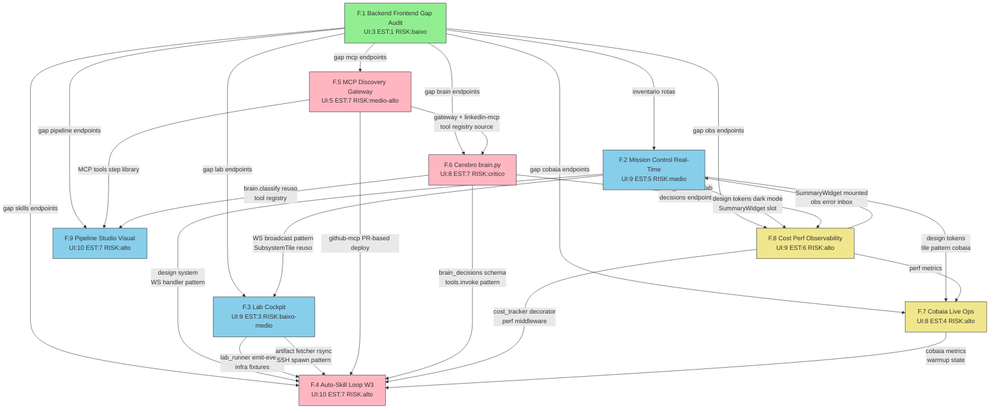

# Hermes Cloud Studio — Implementation Plan Fase F (9 Chapters)

> **Fonte da verdade durável** da Fase F (UI + integração + cérebro + observability + auto-skill).
> Continua o padrão A-E (`IMPLEMENTATION-PLAN.md` original). Sobrevive compressão de contexto.
> Cada chapter tem: contexto, solução, tasks (com pre/post test concretos), APIs novas, DB migrations, UI nova, regression-test gate, done criteria, blockers identificados pelos verificadores.

**Origem**: `.claude/PHASE-F-STUDY-SYNTHESIS.md` + auditoria multi-lens (4 lentes: regression_risk, estimation_realism, guardrails_compliance, ui_empowerment) por chapter.
**Pré-requisito inviolável**: 20/22 PASS preservado nas fases A-E ao fim de TODO commit Fase F. Falha = REVERT mandatório.
**Estratégia**: 9 chapters com paralelismo controlado. F.1 foundation, F.2 design system, F.5+F.3 paralelo, F.8 observability, F.6+F.7 paralelo, F.4+F.9 paralelo.

---

## Arquitetura de referência (sempre re-verificar)

```
PC LOCAL (Windows)
├── Hermes.exe Tauri 2.0 — launcher
├── server.py :55000 — dashboard backend (ORQUESTRA)
├── socks5_proxy.py :55081 + ssh -R tunnel reverso (VM → PC residencial)
├── tunnel_supervisor.py — always-on via Task Scheduler
├── mcps/hermes-control/ — TS MCP server
├── mcps/gateway/ (NOVO F.5) — hermes-mcp-gateway (mas roda na VM)
└── Dashboard SPA — visualiza/controla, NUNCA executa LinkedIn

VM GCP (Linux)
├── hermes_api_v2.py :8420 — backend real (EXECUTA)
├── daemon/orchestrator.py — loop 24/7 P1-P7 (+ F.6 brain delegate, + F.7 day-aware gates)
├── linkedin/ — Patchright + stealth_compliance + preflight + account_profile
├── mcps/gateway/ :55401 (NOVO F.5) — gateway federando 5 customs + N públicos
├── mcps/hermes-linkedin/ (NOVO F.5) — wrap stealth/human/limiter/cooldown
├── vm_lab/skill_sandbox.py (NOVO F.4) — testa skills propostas
├── core/brain.py (NOVO F.6) — Brain.classify + Brain.decide + Brain.evaluate_result
├── Ollama (PC GPU via SSH tunnel reverso :11434)
└── ~/.hermes/skills/ YAML (+ skill_proposals via F.4 propose→lab→accept)
```

**Regra fundamental Fase F**: backend novo SEM frontend = débito imediato em `.claude/FRONTEND-GAP.md`. Mission Control real-time via WS, polling ≥30s só como fallback. Skill auto-gerada NUNCA aplica direto na VM (propõe→lab-test→dashboard accept→sync VM). MCP novo SEMPRE via gateway + allowlist tool descriptions.

---

## Convenções desta sessão de implementação (Fase F)

- **Branch strategy**: trabalho direto em `master`. Commit por task (não por chapter). Push ao fim de cada chapter.
- **Commit message format**: `feat(scope): F.X.task_Y — descrição curta` ou `fix(scope): F.X — desc` ou `docs(audit): F.1 — desc`
- **Test before commit**: rodar `validate_implementation.py --phase A B C D E` ANTES e DEPOIS de toda task com `mature_zone_touch=true`. Comparar `summary.fail` — DEVE permanecer == 2 (E.2 WhatsApp + E.3 Instagram deferidos).
- **Persistência obrigatória por task**:
  1. `mark_chapter` início da task
  2. `TaskCreate` com descrição
  3. Implementar análise + solução + done criteria
  4. Smoke test + pre_test/post_test concretos
  5. `validate_implementation.py --phase A B C D E` (se mature_zone_touch=true)
  6. git commit isolado
  7. `memory_save` tipo bug/architecture/workflow (1-3 sentenças densas, concepts=[hermes, phase-fX, files])
  8. Update `.claude/PLAN.md` checkbox
  9. Update `.claude/GUARDRAILS.md` se regra nova surgir
  10. `TaskUpdate` completed
- **Persistência ao fim do chapter**: `mark_chapter "Phase F.X complete"` + `memory_save` tipo workflow (resumo + arquivos tocados + próximo chapter) + git push.
- **Anti-padrões proibidos**:
  - Skip validate --phase A B C D E em task que toca MADURO
  - Marcar task done sem PASS no validate completo
  - Mexer em arquivo MADURO sem `mature_zone_touch=true` declarado
  - Implementar 2+ tasks no mesmo commit sem necessidade técnica
  - Backend novo SEM consumo frontend (regra Fase F)
  - Polling Mission Control > 5s quando WS up
  - Auto-aplicar skill na VM sem passar pelo accept owner (gate X-Read-Yaml header)
  - Expor MCP público sem allowlist + validator tool descriptions
  - WS broadcast sem prefixo namespace (daemon.* / brain.* / mcp.* / cobaia.* / obs.* / pipeline_studio.* / skill_proposal.* / lab.*)

---

## Sumário Fase F

**Total chapters**: 9 (F.1 a F.9)
**Estimativa raw soma chapters**: 47 sessões (auditoria sinalizou subestimação 50-80% em vários — re-baselining sugerido em refactoring_recommendations §1)
**Estimativa realista pós-refactor**: 75-90 sessões + 72h wall-clock smoke (F.6 + F.7 cobaia warmup)
**Risco perfil**: F.1 (baixo) → F.2/F.3/F.7/F.8/F.9 (médio-alto) → F.4/F.5/F.6 (alto-crítico)
**UI empowerment soma scores**: 72/90 (média 8.0 — alinhado com expectativa owner zero-CLI)

### Grafo de dependências (Mermaid)



### Ordem de execução recomendada

1. **F.1** — Backend↔Frontend Gap Audit (1 sessão, fundação zero-risk, alimenta priorização top-10 dos 8 chapters seguintes)
2. **F.2** — Mission Control Real-Time + Design System (5 sessões, estabelece design tokens + WS broadcast pattern + SubsystemTile + LiveLogTail reusados em F.3/F.4/F.7/F.8/F.9)
3. **F.5** — MCP Discovery + Gateway (7 sessões, hermes-mcp-gateway + hermes-linkedin-mcp DEVE estar pronto antes F.6 registrar tools — bloqueador crítico)
4. **F.3** — Lab Cockpit (3 sessões, paralelo a F.5 — lab_runner --emit-events + skill_sandbox infra reusada por F.4 task_4 fixtures)
5. **F.8** — Cost & Performance Observability (6 sessões, cost_tracker decorator + perf middleware + errors_inbox DEVE estar antes F.4 auto-disable hook e F.6 brain_decisions cost track)
6. **F.6** — Cérebro brain.py (7 sessões, depende F.5 tool registry + F.8 brain_decisions schema/UI + F.2 WS pattern. Shadow mode 24h cobaia ANTES cutover)
7. **F.7** — Cobaia Live Ops (4 sessões, depende F.2 design + F.8 metrics. Paralelo a F.6 shadow mode)
8. **F.4** — Auto-Skill Loop W3 (7 sessões, depende F.3 lab infra + F.5 github-mcp PR deploy + F.6 brain tool registry + F.8 cost tracker — meta-recursivo)
9. **F.9** — Pipeline Studio Visual (7 sessões, paralelo a F.4 — depende F.5 MCP tools step library + F.6 brain tools.invoke pattern)

### Conflitos detectados (mitigações aplicadas nos chapters)

- **daemon/orchestrator.py race**: F.2/F.4/F.6/F.7/F.8 tocam o mesmo arquivo. ORDEM SEQUENCIAL OBRIGATÓRIA: F.2 → F.7 → F.6 → F.4 (com F.8 middleware externo não toca run_loop).
- **WS event namespace overlap**: padrão DOT-NOTATION obrigatório (validator em ws_manager.broadcast rejeita events sem prefixo válido — adicionar em F.2 task_3).
- **Tool registry double-source**: `core/tools.py` (F.6) é FONTE CANÔNICA. F.5 gateway expõe MCPs PARA tools.py consumir. F.9 step library chama `core/tools.py.list_all()`.
- **DB migrations PC+VM race**: namespace `migrations/F.{X}_*.sql` por chapter. F.8 cria schema brain_decisions ANTES F.6 popular.
- **vendor/chart.umd.min.js duplicate**: F.4 e F.8 referenciam mesmo arquivo. Pre_test: `ls dashboard/vendor/chart.umd.min.js OR criar`.
- **GUARDRAILS.md merge conflict**: cada chapter adiciona seção com header próprio (`## MCP/Gateway`, `## Cobaia Live`, `## Observability`, `## Auto-Skill`).

---

# 🟢 Chapter F.1 — Backend↔Frontend Gap Audit

**Classification**: research+ui · **UI score**: 3 · **Estimated**: 1 sessão · **Dependencies**: nenhuma · **Risk**: baixo

### Contexto

Backend Hermes expõe 144+ rotas (93 PC + 51 VM) mas dashboard consome fração. Auditoria sintetizada em `.claude/PHASE-F-STUDY-SYNTHESIS.md §2` já catalogou 11 endpoints fantasma críticos (resolve-conflict, tasks/bulk, stats, daemon/state, daemon/log, daemon/decisions, daemon/channels, daemon/timeline, linkedin/visited, linkedin/comment/edit-delete, agent-zero/status-chat). F.1 mecaniza esse inventário via skill determinística pra alimentar priorização dos 8 chapters seguintes.

### Solução (alinhada arquitetura)

Skill `hermes-frontend-gap` (3 scripts Python) + slash command:
- `parse_routes.py`: AST parse em `api/*.py` + `vm_api/routes.py` + shells → JSON com `{method, path, router_file, line, function, auth_decorator, side}`
- `grep_frontend.py`: regex em `dashboard/app.js` (5429 linhas, 271 fetch calls) + `dashboard/index.html` → mapa endpoint → call sites
- `rank_gaps.py`: cruza routes × consumption → 3 buckets (CONSUMED, ORPHAN, STUB-ONLY) + ranking impacto + gera `.claude/FRONTEND-GAP.md`

Sanity check hard-coded: os 11 fantasmas conhecidos DEVEM aparecer no top 10 ou parser falhou.

### Tasks

#### F.1.task_1 — Parser AST routes PC+VM

`mature_zone_touch: false` · `files_created: [.claude/skills/hermes-frontend-gap/scripts/parse_routes.py]`

**done_criteria**:
- Script usa `ast.parse()` em `api/*.py` (20 arquivos) + `vm_api/routes.py` + shells
- Detecta `@router.{get,post,put,delete,patch}` + `APIRouter prefix` + `@router.websocket`
- Output JSON `.claude/frontend-gap/routes.json` com `{method, path_full, router_file, line, function_name, auth_decorator, side: 'pc'|'vm'}`
- Sanity hard fail se `<140` rotas
- Roda standalone em <30s

**smoke_test**: `python .claude/skills/hermes-frontend-gap/scripts/parse_routes.py && python -c "import json; d=json.load(open('.claude/frontend-gap/routes.json')); assert len(d)>=140"`

#### F.1.task_2 — Grep consumo dashboard/app.js

`mature_zone_touch: false` · `files_created: [.claude/skills/hermes-frontend-gap/scripts/grep_frontend.py]`

**done_criteria**:
- Regex captura `fetch(\`/api/...\`)`, `fetch('/api/...')`, `apiCall('/...')`, WS `/ws` subscriptions
- Path params tolerantes (template literal, concat, hash routes)
- Parser também varre `channels/*.py` + WS event emitters pra cruzar com `socket.on()` em app.js (suggestion lens estimation)
- Output JSON `.claude/frontend-gap/frontend-consumption.json`
- Sanity ≥200 consumos detectados

**smoke_test**: total ≥200 chamadas detectadas.

#### F.1.task_3 — Diff + ranking + FRONTEND-GAP.md

`mature_zone_touch: false` · `files_created: [.claude/skills/hermes-frontend-gap/scripts/rank_gaps.py, .claude/FRONTEND-GAP.md]`

**done_criteria**:
- 3 buckets: CONSUMED, ORPHAN, STUB-ONLY
- Score heurístico: POST/PATCH=3, /daemon|/linkedin|/prospects=2, GET telemetria=1, bonus +2 se hardcoded fantasma
- `.claude/FRONTEND-GAP.md` 4 seções: §1 Inventário, §2 Mapa consumo, §3 Órfãos, §4 TOP 10 priorizado
- Colunas top 10: `[rank, endpoint, método, side, justificativa_uxgain, chapter_destino, freq_cli_owner_hoje, effort_ui, ws_event_needed (boolean), cli_command_replaced, owner_pain_score (1-5)]` (suggestions ui_empowerment lens)
- Assert hard: os 11 fantasmas de PHASE-F-STUDY-SYNTHESIS §2 DEVEM aparecer
- §5 Quick Wins UX + §6 Mission Control endpoints separados

#### F.1.task_4 — Empacotar skill + slash command

`mature_zone_touch: false` · `files_created: [.claude/skills/hermes-frontend-gap/SKILL.md, .claude/commands/hermes-frontend-gap.md]`

**done_criteria**:
- SKILL.md com triggers: `audit frontend`, `frontend gap`, `gap audit backend`, `mapear endpoints`
- Procedimento determinístico 3 passos chamando os 3 scripts em sequência
- Documenta tempo execução esperado <90s + comportamento se sanity asserts falharem (não sobrescrever baseline antigo)
- Slash command invoca skill via Skill tool
- `settings.local.json` permissions escopadas: `python .claude/skills/hermes-frontend-gap/scripts/*.py` (NÃO wildcard amplo)

#### F.1.task_5 — Validação regressão + persistência 6-camadas

`mature_zone_touch: false` · `files_touched: [.claude/PLAN.md, .claude/GUARDRAILS.md]`

**pre_test**: `python scripts/validate_implementation.py --phase A B C D E --json` → assert summary.pass==20 and fail==2 (baseline preservado)
**post_test**: idêntico ao pre_test (zero código produção tocado).

**done_criteria**:
- validate 20/22 PASS preservado
- PLAN.md F.1 checkbox marcado + bullet com link pra FRONTEND-GAP.md
- GUARDRAILS.md regra nova ✅ SEMPRE: "Backend novo SEM consumo frontend = débito imediato → adicionar entrada em .claude/FRONTEND-GAP.md órfãos antes de merge"
- `memory_save` tipo workflow: "hermes F.1 complete — FRONTEND-GAP.md ranking 11+ fantasmas → F.2 consome daemon/* timeline+decisions+state, F.6 consome agent-zero/*"
- `mark_chapter` "Phase F.1 complete — Backend↔Frontend Gap Audit"
- git commit `docs(audit): F.1 — FRONTEND-GAP.md + skill hermes-frontend-gap`

### APIs novas / DB migrations

Nenhuma. Chapter de análise pura.

### UI nova

Nenhuma. Outputs em `.claude/FRONTEND-GAP.md` + JSONs em `.claude/frontend-gap/`.

### Regression-test gate

`validate --phase A B C D E` deve continuar 20/22 PASS. Zero código produção tocado.

### Done criteria do chapter

- `.claude/FRONTEND-GAP.md` existe com 4 seções + top 10 priorizado
- Skill operacional via trigger `audit frontend`
- 11 endpoints fantasma de PHASE-F-STUDY-SYNTHESIS §2 presentes no top 10
- Cada item top 10 mapeado pra chapter F.2-F.9 destino
- validate 20/22 PASS preservado
- PLAN.md + memory_save + mark_chapter + GUARDRAILS atualizado

### Blockers identified by verify

✅ Chapter ACCEPTED (4/4 lenses valid). Suggestions absorvidas no done_criteria expandido (ws_event_needed, cli_command_replaced, owner_pain_score, §5 Quick Wins, §6 Mission Control).

---

# 🟡 Chapter F.2 — Mission Control Real-Time + Design System Polish

**Classification**: ui+backend · **UI score**: 9 · **Estimated**: 5 sessões (auditoria: 6 realista — fatiar F.2.5) · **Dependencies**: F.1 · **Risk**: médio

### Contexto

Mission Control atual (`/dashboard#control`) é Activity Orbit estática + polling agressivo. Endpoints `/api/daemon/{state,log,decisions,channels,timeline}` expostos mas sub-consumidos. F.2 substitui polling por WS broadcasts, adiciona SubsystemTileGrid (6 tiles: LinkedIn/Email/Scraper/Audit/Daemon/Tunnel) com Pause/Resume individual, LiveLogTail, e design system tokens (dark mode + toast + skeleton).

### Solução (alinhada arquitetura)

- Backend: novo `/api/daemon/subsystems` agregando status (lê runtime_state + daemon_state + channels stats). `/api/daemon/subsystems/{name}/pause|resume` persiste em `runtime_state` (via `set_runtime_state` key/value — NÃO ALTER TABLE, blocker resolvido). Loops maduros (sync, linkedin_sync, scheduler, email) ganham gate `subsystem_pauses` check no início do body. WS broadcast em transição de estado, NÃO em cada iteração.
- Frontend: novo `dashboard/styles/tokens.css` + `dark.css` + `components/toast.js` + `components/skeleton.js`. Mission Control rework com SubsystemTile, LiveLogTail virtualizada, PrefPanel (`/api/user-prefs`).

### Blockers identified by verify (RESOLVER ANTES DE IMPLEMENTAR)

1. **F.2.1 core/state.py contradiction**: risk_assessment diz "NUNCA modificar core/state.py" mas files_touched lista. **Decisão**: usar `set_runtime_state('subsystem_pauses', json)` via key/value pattern existente. REMOVER `core/state.py` de files_touched. Se helper não suportar JSON merge, criar em `api/daemon.py`.
2. **db_migrations `subsystem_health` opcional**: decisão pré-implementação: **NÃO criar tabela**, computar via endpoint (mais simples, sem migration race).
3. **estimated_sessions=5 → 6**: splitar F.2.5 em F.2.5a (SubsystemTileGrid + WS handlers) e F.2.5b (LiveLogTail + PrefPanel).
4. **Migration espelhada VM**: documentar `runtime_state` existe PC+VM. Migration aplicada via SSH em ambos: `ssh hermes-gcp 'python3 -c "..."'`. ALTER COLUMN idempotente via `PRAGMA table_info` check (SQLite não tem IF NOT EXISTS em ADD COLUMN).
5. **F.2.5 mature_zone_touch = TRUE** (dashboard/app.js é maduro — sanitizeClaudeHtml). Pre_test: `grep -c sanitizeClaudeHtml dashboard/app.js`. Post_test: validate --phase E PASS + novos `innerHTML +=` passam sanitize.
6. **F.2.4 DOMPurify**: explicitar uso de `dashboard/vendor/purify.min.js` LOCAL (NÃO import externo).
7. **WCAG AA**: usar `axe-core` via Playwright eval — done_criteria objetivo: "0 violations contrast em /dashboard#control".
8. **Polling fallback ≥30s mensurável**: post_test F.2.5 — "sem requests `/api/daemon/state` com WS up durante 60s window" (Network panel ou backend log count).

### Tasks

#### F.2.1 — Backend `/api/daemon/subsystems` + persist `runtime_state`

`mature_zone_touch: true` (api/daemon.py)
`files_touched: [api/daemon.py]` (core/state.py REMOVIDO — usar set_runtime_state existente)
`regression_phases_to_revalidate: [A, B, C, D, E]`

**pre_test**:
```bash
python scripts/validate_implementation.py --phase A B C D E --json > /tmp/pre_f21.json
curl -s -H "Authorization: Bearer $HERMES_AUTH_TOKEN" http://127.0.0.1:55000/api/daemon/state | jq .state
```

**post_test**:
```bash
curl -s -H "Authorization: Bearer $HERMES_AUTH_TOKEN" http://127.0.0.1:55000/api/daemon/subsystems | jq '.subsystems | length'  # 6
curl -X POST -H "Authorization: Bearer $HERMES_AUTH_TOKEN" "http://127.0.0.1:55000/api/daemon/subsystems/linkedin/pause?minutes=5"
sqlite3 hermes_local.db "SELECT value FROM runtime_state WHERE key='subsystem_pauses'" | jq '.linkedin'
python scripts/validate_implementation.py --phase A B C D E --json | jq '.summary.fail==2'
```

**done_criteria**:
- GET `/api/daemon/subsystems` retorna 6 subsistemas com status real lido de daemon_state + channels stats
- POST pause/resume persiste em runtime_state key `subsystem_pauses` (JSON map name→until_ts)
- Endpoints autenticados Bearer (`Depends(get_current_user)`)
- `@limiter.limit('30/minute')` em pause/resume
- validate A B C D E preservado

#### F.2.2 — Gate `subsystem_pauses` em loops maduros

`mature_zone_touch: true`
`files_touched: [loops/sync.py, loops/linkedin_sync.py, loops/linkedin_scheduler.py, channels/email/sender.py]`
`regression_phases_to_revalidate: [A, B, C, D, E]`

**pre_test**: validate full + `grep -n 'def send' channels/email/sender.py` baseline + tail loops logs.
**post_test**: pause linkedin 2min → tail logs grep `linkedin paused.*skip` em CADA um dos 4 arquivos touched + validate full + email gate test concreto (mock send + pause email + assert skip).

**done_criteria**:
- Cada loop lê `runtime_state.subsystem_pauses` no início do body, skip iteration se paused
- Skip log via `logger.info(..., extra={"category": "subsystem_pause"})`
- Pause de 'email' bloqueia `channels/email/sender.send()` ANTES de qualquer write em `email_rate.db`
- Try/except + `logger.exception` preservado (MERGED-007)
- validate 20/22 PASS

#### F.2.3 — WS broadcast `subsystem_status` + `daemon_log_event` + `decision_event`

`mature_zone_touch: true`
`files_touched: [loops/sync.py, loops/linkedin_sync.py, loops/linkedin_health.py, api/daemon.py, daemon/orchestrator.py]`
`regression_phases_to_revalidate: [A, B, C, D, E]`

**pre_test**: validate full + `grep -n spawn` em todos arquivos touched (confirma MERGED-015) + verificar `scripts/ws_test_subscriber.py` existe (criar se não).
**post_test**: `python scripts/ws_test_subscriber.py --types subsystem_status,daemon_log_event,decision_event --timeout 60` recebe ≥3 events distintos + validate full.

**done_criteria**:
- Broadcasts via `ws_manager.broadcast()` SOMENTE em transição de estado (não cada iter)
- `daemon/orchestrator.py` broadcast `decision_event` quando registra em `daemon_decisions`
- pause/resume endpoints broadcast `subsystem_status` imediato
- WS auth `?token=` preservado (MERGED-001)
- Zero `asyncio.create_task` bare — usar `spawn()` (MERGED-015)
- Namespace dot-notation: `daemon.subsystem_status`, `daemon.log_event`, `daemon.decision`

#### F.2.4 — Design system: tokens + dark mode + toast + skeleton

`mature_zone_touch: false`
`files_created: [dashboard/styles/tokens.css, dashboard/styles/dark.css, dashboard/components/toast.js, dashboard/components/skeleton.js]`
`files_touched: [dashboard/styles.css, dashboard/index.html]`

**visual_proof**: `http://127.0.0.1:55000/dashboard#control` — toggle dark mode + 3 toasts (success/warn/error) + skeleton em loading. Baselines em `.claude/screenshots/baseline/control_dark.png` + `control_light.png`. axe-core eval = 0 contrast violations.

**done_criteria**:
- `tokens.css`: paleta + spacing + typography + radii em CSS vars
- `dark.css`: overrides `--color-*` sob `[data-theme=dark]`
- `toast.js`: `window.toast.{success,warn,error,info}` usa **`dashboard/vendor/purify.min.js` LOCAL** (NÃO CDN, NÃO @import externo de fontes)
- `skeleton.js`: `window.skeleton.{show,hide}`
- WCAG AA via axe-core: 0 violations
- Zero CDN runtime (MERGED-019)

#### F.2.5a — UI Mission Control: SubsystemTileGrid + WS handlers

`mature_zone_touch: true` (dashboard/app.js)
`files_touched: [dashboard/app.js, dashboard/index.html, dashboard/styles.css]`
`files_created: [dashboard/components/subsystem_tile.js]`
`regression_phases_to_revalidate: [A, E]`

**pre_test**: `grep -c sanitizeClaudeHtml dashboard/app.js > /tmp/sanitize_before.txt`
**post_test**: `diff <(grep -c sanitizeClaudeHtml dashboard/app.js) /tmp/sanitize_before.txt` (count ≥ antes) + validate --phase E PASS + DevTools: zero requests `/api/daemon/state` durante 60s window com WS up.

**visual_proof**: 6 SubsystemTile coloridos por status (verde/amarelo/vermelho), click Pause LinkedIn → vira amarelo + countdown + toast 'LinkedIn paused 5min' + WS broadcast atualiza outros tabs <2s. `.claude/screenshots/f2/mission_control_v2.png`.

**done_criteria**:
- 6 SubsystemTile com badge status + última ação + próxima ação + pause btn
- WS handlers `daemon.subsystem_status` + `daemon.log_event` + `daemon.decision`
- Polling fallback ≥30s apenas se WS down
- Toda `innerHTML +=` passa `sanitizeClaudeHtml` (MERGED-019)
- Páginas legacy intactas

#### F.2.5b — UI LiveLogTail + PrefPanel + `/api/user-prefs`

`mature_zone_touch: true` (dashboard/app.js)
`files_created: [dashboard/components/live_log_tail.js, dashboard/components/pref_panel.js]`
`regression_phases_to_revalidate: [E]`

**done_criteria**:
- LiveLogTail virtualizada (200 entries cap), auto-scroll, pause-on-hover
- PrefPanel grava `/api/user-prefs` (theme/refresh_rate/collapsed/tile_order/tile_visibility)
- PUT idempotente + version increment em runtime_state.user_prefs JSON merge
- Sound notification toggle pra error toasts
- Badge counter no tab title quando errors unread

### APIs novas

- `GET /api/daemon/subsystems` — snapshot 6 subsistemas
- `POST /api/daemon/subsystems/{name}/pause` (rate-limited 30/min)
- `POST /api/daemon/subsystems/{name}/resume`
- `GET /api/daemon/logs/stream` — SSE filtros category+level (auth + rate-limit)
- `GET /api/user-prefs`
- `PUT /api/user-prefs`

### DB migrations

- `runtime_state` key `subsystem_pauses` (JSON map name→until_ts) — via set_runtime_state, NÃO ALTER TABLE
- `runtime_state` key `user_prefs` (JSON) — idem
- Migration espelhada PC + VM via SSH

### UI nova

`/dashboard#control` rework: SubsystemTileGrid, ActivityOrbitV2, LiveLogTail, TimelineV2, DecisionsLiveCard, PauseResumeButton, PrefPanel.
WS events: `daemon.subsystem_status`, `daemon.log_event`, `daemon.decision`, `daemon.timeline`, `daemon.channel_stats`.

### Regression-test gate

`validate --phase A B C D E` 20/22 PASS preservado em F.2.1 + F.2.2 + F.2.3 + F.2.5a + F.2.5b.

### Done criteria do chapter

- 6 endpoints `/api/daemon/*` consumidos UI (estado real-time, sem stale)
- Subsystem pause/resume via UI individual + global panic button (suggestion)
- WS broadcasts substituem polling Mission Control (fallback ≥30s)
- Design system + dark mode + toast + skeleton operacionais
- User prefs persistem cross-session
- validate 20/22 PASS preservado em todas as 5 tasks
- GUARDRAILS.md atualizado: 🚫 NUNCA pollar Mission Control >5s quando WS up / ✅ SEMPRE `ws_manager.broadcast` em mudança de estado loops
- Screenshots baseline gravados `.claude/screenshots/f2/`

---

# 🟢 Chapter F.3 — Lab Cockpit no-code

**Classification**: ui+backend · **UI score**: 9 · **Estimated**: 3 sessões (auditoria: 5-6 realista) · **Dependencies**: F.1 · **Risk**: baixo-médio

### Contexto

`linkedin/lab/lab_runner.py` hoje só via CLI. Owner perde tempo em SSH+terminal pra rodar fingerprint/login/viewer flows. F.3 entrega `/dashboard#lab` com flow selector, live screenshot, stdout streaming, compliance score com baseline delta, runs history navegável.

### Solução

- Backend: `api/lab.py` + `core/lab_orchestrator.py`. SSH spawn via `asyncio.create_subprocess_exec('ssh', ...)` (padrão `api/server_ctrl.py:server_restart_vm` — **NÃO paramiko/asyncssh**, blocker resolvido). Tail stdout via SSH stream, parse NDJSON, grava `lab_runs/lab_artifacts` incremental, emite WS.
- Wrapper: `linkedin/lab/lab_runner.py` aceita flag `--emit-events` (default false pra backward compat) emitindo NDJSON `{event, step, ts, ...}` em stdout. `_event_emitter.py` centraliza com flush imediato.
- Artifact fetcher: **sftp.get via paramiko/asyncssh OU subprocess scp/sftp** (rsync NÃO existe Windows nativo — blocker resolvido). Cache `lab_cache/` LRU 2GB. Thumbnail Pillow on-demand.
- State guard: `runtime_state.lab_active_run_id` via `set_runtime_state` (key/value pattern, NÃO ALTER TABLE).

### Blockers identified by verify (RESOLVER ANTES DE IMPLEMENTAR)

1. **F.3.1 mature_zone_touch = TRUE** (core/state.py modificado via init_db). regression_phases_to_revalidate=[A] mínimo + grep_present `_LI_SESSION_FAIL_STREAK` baseline.
2. **F.3.3 mature_zone_touch = TRUE** (server.py include_router). Pre_test: `curl /api/dashboard sem token = 401` baseline. Post_test: `curl /api/lab/start sem token = 401` + `curl /api/dashboard ainda 401` + WS `/ws` ainda conecta.
3. **SSH pattern**: usar `asyncio.create_subprocess_exec('ssh', ..., StrictHostKeyChecking=no, ConnectTimeout=10, settings.vm_user/vm_host)` — padrão real do projeto.
4. **Auth**: middleware global em `server.py:170-181` (X-Hermes-Token + `secrets.compare_digest`), **NÃO** `_check_auth` dep. Verificar `/api/lab/*` NÃO está em allowlist sem auth.
5. **runtime_state schema**: NÃO ALTER TABLE. Usar `set_runtime_state('lab_active_run_id', run_uid)` no key/value existente.
6. **F.3.4 toca loops/sync.py**: `mature_zone_touch=true`, regression_phases=[B]. Smoke: cleanup não bloqueia loop (timeout <5s).
7. **F.3.5 + F.3.6 mature_zone_touch = TRUE** (dashboard/app.js MADURO). Pre_test: navegar todas páginas atuais + WS conecta. Post_test: mesmas páginas continuam OK + `grep sanitizeClaudeHtml` count ≥ baseline.
8. **estimated_sessions 3 → 5-6**: fatiar F.3.5 (5a scaffold + 5b live painel) e F.3.6 (6a compliance + 6b history drawer).
9. **Compliance score indicators fechados**: 10 checks: `webdriver, webgl_vendor, timezone, languages, user_agent, plugins_length, hardware_concurrency, screen_resolution, canvas_hash, audio_hash`.
10. **lab_cache/ adicionar ao .gitignore explícito**.
11. **SSH disconnect mid-run**: documentar comportamento — heartbeat 30s, orphan VM process detected via `ps`, cleanup automático.

### Tasks (fatiado conforme blockers)

#### F.3.1 — Schema + state guard

`mature_zone_touch: true` · `regression_phases_to_revalidate: [A]`
`files_created: [migrations/F.3_lab_cockpit.sql, core/lab_state.py]`

**done_criteria**:
- 3 tabelas `lab_runs`, `lab_artifacts`, `lab_fingerprint_baselines` via `db_utils._connect` (WAL + busy_timeout 30s)
- `set_runtime_state('lab_active_run_id', ...)` pattern (não ALTER TABLE)
- `core/lab_state.py`: `set_active_run/clear_active_run/get_active_run` com lock
- Migration idempotente (2x sem erro)
- validate phase A PASS pré/pós

#### F.3.2 — lab_runner.py wrapper NDJSON

`mature_zone_touch: false`
`files_touched: [linkedin/lab/lab_runner.py]`
`files_created: [linkedin/lab/_event_emitter.py]`

**done_criteria**:
- `--emit-events` flag (default false pra backward compat)
- NDJSON events `{step_start, step_done, screenshot, compliance_score, error, finished}` com `sys.stdout.flush()` após cada
- Smoke manual: `python -m linkedin.lab.lab_runner` SEM `--emit-events` funciona modo legacy
- Interleaving prints legacy + NDJSON testado (prefix tag ou pipe stderr separado)

#### F.3.3 — `api/lab.py` + SSH spawn + WS

`mature_zone_touch: true` · `regression_phases_to_revalidate: [A]`
`files_created: [api/lab.py, core/lab_orchestrator.py]`
`files_touched: [server.py]`

**done_criteria**:
- Router `/api/lab` registrado, auth via middleware global (X-Hermes-Token)
- POST `/start` usa `asyncio.create_subprocess_exec ssh` (padrão `api/server_ctrl.py`)
- `spawn()` helper pra task background (MERGED-015)
- 409 conflict se `lab_active_run_id` ocupado
- POST `/stop` envia SIGTERM remoto + limpa state
- Stdout streaming via `asyncio.StreamReader` line-by-line com limit explícito (evita deadlock)
- WS debounce client-side 500ms pra `lab.run.update` (evita flicker)
- `settings.vm_host` (config.py canônico)

#### F.3.4 — Artifact fetcher + cache + cleanup

`mature_zone_touch: true` (loops/sync.py) · `regression_phases_to_revalidate: [B]`
`files_created: [core/lab_artifacts.py]`
`files_touched: [loops/sync.py]` (adicionar `_cleanup_lab_artifacts` call)

**done_criteria**:
- `core/lab_artifacts.fetch_artifact()` via sftp.get (compare mtime/size antes refetch)
- `lab_cache/` dir em raiz (gitignored explícito)
- Thumbnail endpoint `?thumb=1` retorna 200x200 PNG via Pillow (instalado PC, NÃO VM)
- Cleanup artifacts >30d em `loops/sync.py._cleanup_lab_artifacts` (NÃO nova loop)
- Cache cap 2GB, purge LRU
- Smoke MERGED-006 sync versioning preservado (conflict_at não muda pós cleanup)

#### F.3.5a — UI scaffold (page + nav + flow selector + start button + WS skeleton)

`mature_zone_touch: true` (dashboard/app.js) · `regression_phases_to_revalidate: [E]`
`files_touched: [dashboard/app.js, dashboard/index.html, dashboard/styles.css]`

**visual_proof**: `http://127.0.0.1:55000/dashboard#lab` — header + badge IDLE + 3 flow cards + button INICIAR LAB.

**done_criteria**:
- Rota hash `#lab` em `app.js navigate()` switch
- Sidebar nav item 'Lab' com badge contador runs ativas
- Toda `innerHTML +=` via `sanitizeClaudeHtml` (MERGED-019)
- WS subscriber skeleton `lab.*` herda `?token=` do WS singleton

#### F.3.5b — Live painel (screenshot + stdout terminal + steps timeline + CSS polish)

`mature_zone_touch: true` (dashboard/app.js) · `regression_phases_to_revalidate: [E]`

**done_criteria**:
- Live screenshot `` com fade transition CSS quando src muda
- Stdout div max-height + autoscroll, ANSI-stripped via lib documentada (`strip-ansi`), cap 500 lines com warning visual ao truncar
- Steps timeline com spinners + checkmarks
- 'Copy last 50 lines' button (clipboard)

#### F.3.6a — Compliance score + baseline delta

`mature_zone_touch: false`
`files_touched: [api/lab.py, core/lab_orchestrator.py]`

**done_criteria**:
- `compute_compliance_score()` baseado nos **10 indicators fechados**: webdriver, webgl_vendor, timezone, languages, user_agent, plugins_length, hardware_concurrency, screen_resolution, canvas_hash, audio_hash
- `compute_baseline_delta(current, baseline)` retorna `{score_delta, changed_indicators[]}`
- POST `/api/lab/baseline/{site}` UPSERT
- Toast 'Lab finalizado: score 87/100 (+2 vs baseline)' ao WS `lab.run.finished`

#### F.3.6b — History drawer + artifact grid + JSON viewer + promote

`mature_zone_touch: true` (dashboard/app.js) · `regression_phases_to_revalidate: [E]`
`files_created: [dashboard/components/lab_drawer.js]`

**done_criteria**:
- Drawer slide-in 480px, ESC + backdrop click-out
- Artifact grid thumbnails 160x90 + click expand fullscreen modal
- JSON viewer collapsible (lib `json-viewer-js` ~5KB local OU implementação minimal 50 linhas documentada)
- Diff visual fingerprint atual vs baseline (side-by-side JSON, keys mudadas highlighted vermelho/verde)
- Promote button → POST baseline + refresh delta cards visíveis sem reload

### APIs novas

`GET /api/lab/runs`, `POST /api/lab/start`, `GET /api/lab/runs/{run_id}`, `GET /api/lab/runs/{run_id}/artifacts`, `GET /api/lab/runs/{run_id}/artifacts/{artifact_id}/blob`, `POST /api/lab/runs/{run_id}/stop`, `GET /api/lab/baseline`, `POST /api/lab/baseline/{site}`, WS event `lab.run.update`, `lab.run.finished`, `lab.baseline.promoted`.

### DB migrations

`lab_runs`, `lab_artifacts`, `lab_fingerprint_baselines` em hermes_local.db (PC). `runtime_state.lab_active_run_id` via key/value.

### UI nova

`/dashboard#lab` (Lab Cockpit) + `/dashboard#lab/runs/{run_id}` (drawer modal).

### Regression-test gate

`validate --phase A B C D E` 20/22 PASS preservado em F.3.1, F.3.3, F.3.4, F.3.5a, F.3.5b, F.3.6b.

### Done criteria do chapter

- Owner roda 3 flows end-to-end SEM tocar terminal
- Live screenshot atualiza <3s após capture VM
- Compliance score visível com cor + delta numérico
- Histórico 50 runs navegável com drawer mostrando artifacts
- Baseline promove via UI 1-click
- Spawn duplicado bloqueado (409 conflict)
- Stop button funciona (SIGTERM + cleanup)
- Auth: `/api/lab/*` exige token (curl sem = 401)
- Lab cache <2GB com auto-purge LRU >30d
- Endpoints registrados em FRONTEND-GAP.md como consumidos

---

# 🔴 Chapter F.4 — Auto-Skill Loop W3 (Hermes propõe → lab-testa → owner aprova)

**Classification**: architectural+ui · **UI score**: 10 · **Estimated**: 7 sessões (auditoria: 11 realista — fatiar tasks 2, 4, 9, 10) · **Dependencies**: F.1, F.2, F.3, F.5, F.6, F.8 · **Risk**: ALTO (meta-recursivo)

### Contexto

Hoje skills LinkedIn em `~/.hermes/skills/` são manuais. Hermes nunca evolui sozinho. F.4 fecha o loop W3: workflow `hermes-skill-forge.js` analisa activity_log 30d, classifica intents recorrentes via Ollama, propõe skill YAML, lab sandbox testa contra 10+ fixtures (incluindo injection tests OWASP LLM01), owner aprova via dashboard com YAML diff highlight obrigatório + checkbox 'li o YAML', deploy staged scp + validate + restart + health check + rollback automático.

Auto-disable após 5 erros consecutivos OU cost > budget. Telegram alert.

### Solução

**Componentes**:
1. Workflow `.claude/workflows/hermes-skill-forge.js` (cooldown 24h, max 3 propostas/run, max 1 em prod)
2. Schema `skill_proposals` (PC) + `skill_metrics` (VM) + `skill_fixtures` (VM novo DB `lab_fixtures.db`)
3. `api/skill_proposals.py` com 10 endpoints + WS broadcast 8 eventos
4. Lab sandbox `vm_lab/skill_sandbox.py` + `snapshot_prod.py` (wipe PII)
5. Deploy pipeline `core/skill_deployer.py` (scp → validate → restart → health 5s/30s → rollback)
6. Instrumentation VM `@track_skill_metrics` decorator
7. Auto-disable loop `loops/skill_monitor.py`
8. UI `/skills/proposals` com diff2html LOCAL + lab runner live + metrics Chart.js 7d

### Blockers identified by verify (RESOLVER ANTES DE IMPLEMENTAR)

1. **Task 0 (NOVA) pre-flight**: snapshot full state (validate --phase A-E + sha256 todos arquivos maduros) em `.claude/snapshots/F4-pre.json` + git tag pre-F4 pra rollback determinístico.
2. **Task 1 (DB schema) regression_phases_to_revalidate=[A]**: core/state.py é mature zone.
3. **Task 2 endpoints**: pre_test inclui curl `/api/internal/*` sem token retornando 403 + wscat sem token retornando close 1008 (MERGED-001 + MERGED-003 não regridem).
4. **Task 5 deploy**: regression_phases inclui [D] (LinkedIn pipeline pós-restart). Post_test: `curl /api/linkedin/health == ok`. Adicionar `@limiter.limit('1/minute')` em POST `/accept` (MERGED-020 + MERGED-002 combinados criam vetor DoS).
5. **Task 5 reload sem downtime**: trocar `systemctl restart` por SIGHUP handler ou supervisord reload (evita window unavailability afetando MERGED-018 session monitor).
6. **Task 6 decorator @track_skill_metrics**: pre_test baseline latency `ollama_router` (média 10 runs). Post_test assert delta <5ms.
7. **Task 7 telegram_bridge.py**: NÃO existe em `channels/email/` — verificar caminho real ou criar gap. `files_touched` falta `server.py` (lifespan registro do loop).
8. **Task 8 mature_zone_touch=TRUE** (dashboard/app.js). Pre_test: `grep DOMPurify` + validate --phase E + sha256 baseline. diff2html LOCAL (NÃO CDN).
9. **Task 10 harness change**: snapshot baseline ANTES de mexer validate harness.
10. **Cross-task arquitetura skill_metrics PC vs VM**: definir OWNER ÚNICO. Opção A (VM escreve, PC lê via SSH on-demand — latência). Opção B (VM sync push para PC a cada 60s — MERGED-006 pattern). **DECISÃO: B** (consistente com sync_loop existente).
11. **WS 8 events**: confirmar `/ws?token=` exige auth em subscribe `skill_proposals` (MERGED-001).
12. **lab_fixtures.db é arquivo NOVO**: migration cria file se não existe + idempotência testada (2x consecutivos).
13. **estimated_sessions 7 → 11**: fatiar Task 2 (2a CRUD + 2b lifecycle), Task 4 (4a snapshot+wipe+fixtures + 4b sandbox+cost+injection+gate), Task 9 (9a lab panel + ForgeNow + 9b metrics chart + auto-disable badge), Task 10 (10a harness extensions + 10b docs).
14. **PII checklist no snapshot_prod.py**: wipe `prospects.email/phone/whatsapp/name`, `messages.body`, `activity_log.payload` (regex email+phone), `users.email`.
15. **Injection tests OWASP**: 2 injection: 1 jailbreak (ignore previous), 1 data exfil (output system prompt).
16. **Health check task 5**: timeout 60s com retry exp 2s/4s/8s (cold start ollama pode flap em 5s).
17. **Endpoint `/api/skill-proposals/{id}/enable`** (re-enable) — visual_proof task_9 cita 'Re-enable' mas não existia na lista.

### Tasks (fatiado conforme blockers — 11 tasks finais)

#### F.4.task_0 — Pre-flight snapshot + git tag

`mature_zone_touch: false`
`done_criteria`: snapshot validate A-E em `.claude/snapshots/F4-pre.json` + `git tag pre-F4` + sha256 de todos arquivos maduros tocados nas tasks seguintes.

#### F.4.task_1 — Schema DB skill_proposals + skill_metrics + skill_fixtures

`mature_zone_touch: false` · `regression_phases_to_revalidate: [A]`
`files_created: [migrations/F.4_skill_proposals.sql (PC + VM), scripts/migrate_skill_proposals.py]`

**done_criteria**: 4 tabelas com 14+ colunas, índices, idempotente, db_utils._connect canônico.

#### F.4.task_2a — Backend CRUD (5 endpoints: list/get/propose/reject/edit) + auth fail-closed + cooldown 24h

`mature_zone_touch: false` (api novo) · `regression_phases_to_revalidate: [A, B]`
**done_criteria**: 5 endpoints, todos exigem `HERMES_AUTH_TOKEN`, UPDATE sempre version+=1.

#### F.4.task_2b — Backend lifecycle (5 endpoints: lab-test/accept/disable/enable/metrics/stream) + WS broadcast 8 eventos

**done_criteria**: POST accept exige header `X-Read-Yaml: true` (gate humano). `@limiter.limit('1/minute')` em accept. WS namespace `skill_proposal.*`. Endpoint `/enable` re-enable.

#### F.4.task_3 — Workflow `hermes-skill-forge.js`

`mature_zone_touch: false`
**done_criteria**: lê activity_log 30d, classify via `ollama_router.route(task='classify')`, propõe N≤3 com cost_budget_per_day obrigatório, consulta ToolRegistry (F.6) ANTES propor pra evitar redundância, cooldown 24h (exit 2 + log).

#### F.4.task_4a — snapshot_prod.py + wipe PII + seed fixtures

`mature_zone_touch: false`
**done_criteria**: backup `~/.hermes/data/` ANTES snapshot. Wipe explícito: prospects.email/phone/whatsapp/name, messages.body, activity_log.payload, users.email. 10+ fixtures (5 happy + 3 edge + 2 injection OWASP + 1 cost_limit).

#### F.4.task_4b — skill_sandbox.py runner + cost tracker + injection gate

`mature_zone_touch: false`
**done_criteria**: roda APENAS na VM. Cost tracker mede USD por fixture, rejeita se total > `cost_budget_per_day*1.5`. Gate 8+/10 fixtures pass + 100% injection blocked → `status=lab_pass`.

#### F.4.task_5 — Deploy pipeline (scp staged → validate → reload SIGHUP → health 60s → rollback)

`mature_zone_touch: false` · `regression_phases_to_revalidate: [A, C, D]`
**done_criteria**: `X-Read-Yaml: true` obrigatório. scp `/tmp/staged_<id>.yaml` na VM. Validate YAML parse + schema. **SIGHUP reload em vez de restart** (evita downtime + MERGED-018). Health check loop 5s/timeout 60s com retry exp 2s/4s/8s. Rollback automático se health falhar. `@limiter.limit('1/minute')` POST accept. Post_test: `curl /api/linkedin/health == ok`.

#### F.4.task_6 — Instrumentation `@track_skill_metrics` em VM

`mature_zone_touch: true` (hermes_api_v2.py, linkedin/ollama_router.py) · `regression_phases_to_revalidate: [A, B, D, E]`
**done_criteria**: decorator captura `skill_name, latency_ms, success, error_msg, cost_usd, model`. INSERT via `db_utils._connect` (WAL). NÃO bloqueia request principal (try/except + logger.exception). functools.wraps preservado (inspect.signature idêntico). Pre/post baseline latency, assert delta <5ms.

#### F.4.task_7 — Auto-disable hook `loops/skill_monitor.py`

`mature_zone_touch: true` (server.py lifespan, channels/email/sender.py) · `regression_phases_to_revalidate: [A, E.1]`
**done_criteria**: loop 60s polling VM skill_metrics. Query: `SUM(NOT success)>=5 nos últimos 10 runs OR SUM(cost_usd 24h) > cost_budget`. UPDATE status='disabled' + SSH `mv ~/.hermes/skills/<name>.yaml ~/.hermes/skills/disabled/` + reload. Telegram alert via canal Hermes (verificar telegram_bridge.py existe ou criar). `spawn()` + `_background_tasks` set (MERGED-015). DRY_RUN env var por 24h primeiro deploy prod.

#### F.4.task_8 — UI `/skills/proposals` list + drawer + YAML diff (diff2html LOCAL)

`mature_zone_touch: true` (dashboard/app.js, dashboard/styles.css) · `regression_phases_to_revalidate: [E]`
`files_created: [dashboard/vendor/diff2html.min.js, dashboard/vendor/diff2html.min.css, dashboard/components/skill-proposals.js, dashboard/components/yaml-diff-viewer.js]`

**visual_proof**: header 'Skill Proposals' + filtros (draft/lab_pass/active/disabled), grid cards com rationale + status badge + ForgeNow button com cooldown countdown. Click → drawer 60% width + YAML diff side-by-side + checkbox 'Li o YAML' habilita Accept. `.claude/screenshots/baseline/skills-proposals-{empty,populated}.png`.

**done_criteria**:
- Página `/skills/proposals` no router hash
- diff2html vendor LOCAL (NÃO CDN — MERGED-019)
- Checkbox 'Li o YAML' gate visual obrigatório
- TODO HTML dinâmico via `sanitizeClaudeHtml()`
- 8 WS handlers `skill_proposal.*` atualizam list/drawer in-place
- Empty state amigável + Copy/Download YAML buttons
- Toast pós-deploy success/fail + link 'View deploy log'

#### F.4.task_9a — UI lab test runner + ForgeNow countdown

`mature_zone_touch: true` (dashboard/app.js) · `regression_phases_to_revalidate: [E]`
**done_criteria**: LabResultPanel grid 4 categorias (happy/edge/injection/cost_limit) + WS handler `skill_proposal.lab_fixture_progress` live + ForgeNow button POST `/propose` + setInterval countdown.

#### F.4.task_9b — UI metrics Chart.js 7d + auto-disable badge

`mature_zone_touch: true` (dashboard/app.js) · `regression_phases_to_revalidate: [E]`
`files_created: [dashboard/components/skill-metrics-chart.js, dashboard/vendor/chart.umd.min.js]` (compartilhado com F.8)
**done_criteria**: SkillMetricsChart 3 séries (success_rate, latency_p99, cost_usd) 7d. AutoDisable badge vermelho + mini-sparkline últimos 10 runs (✓✗✗✗✗✗) inline. Tab Metrics aparece só se status IN (active, disabled).

#### F.4.task_10a — Validation harness extensions (3 CHECK_RUNNERS novos)

`mature_zone_touch: true` (scripts/validate_implementation.py)
**done_criteria**: `check_ui_visible` (Playwright headful), `check_ws_subscribed`, `check_regression_phase_pass`. Parser regex ampliado: `^### ([A-Z]+-[A-Z0-9.]+(?:_\d+)?)`. Pre_test snapshot validate A-E.

#### F.4.task_10b — VALIDATION-CHECKLIST F.4 + PLAN + GUARDRAILS + persistência

`mature_zone_touch: false`
**done_criteria**: VALIDATION-CHECKLIST.md sections F.4.task_N. GUARDRAILS adiciona seção `## Auto-Skill (F.4)`: 🚫 NUNCA aplicar skill_proposal sem lab_pass 8+/10. 🚫 NUNCA accept sem header X-Read-Yaml. 🚫 NUNCA forge >1x/24h. ✅ SEMPRE deploy staged + validate + rollback. ✅ SEMPRE skill_metrics tracked. ✅ SEMPRE cost_budget_per_day no YAML.

### APIs novas

10 endpoints `/api/skill-proposals/*` + WS namespace `skill_proposal.*`.

### DB migrations

`skill_proposals` (PC), `skill_proposals_revisions` (PC), `skill_metrics` (VM command_center.db), `skill_fixtures` (VM novo `lab_fixtures.db`).

### UI nova

`/skills/proposals` (new page) + `/skills` (augment com badge 'proposed by forge').

### Regression-test gate

`validate --phase A B C D E` 20/22 PASS preservado em task_1, task_2a, task_2b, task_5, task_6, task_7, task_8, task_9a, task_9b, task_10a.

### Done criteria do chapter

- Workflow `.claude/workflows/hermes-skill-forge.js` operacional dry-run + prod, cooldown 24h
- Lab sandbox executa skill contra 10+ fixtures + gate 8+/10 + 100% injection blocked
- Deploy pipeline `X-Read-Yaml` + staged + validate + reload + health 60s + rollback
- Auto-disable hook detecta 5 erros consecutivos OU cost > budget → disable + Telegram
- UI `/skills/proposals` com YAML diff (diff2html LOCAL) + sanitizeClaudeHtml em todo HTML
- Metrics Chart.js 7d + AutoDisable badge + ForgeNow countdown
- validate 20/22 PASS preservado
- GUARDRAILS atualizado com 3 NUNCA + 3 SEMPRE F.4

---

# 🟡 Chapter F.5 — MCP Discovery + Integration + Gateway

**Classification**: research+backend · **UI score**: 5 · **Estimated**: 7 sessões (auditoria: 10-12 realista — fatiar 5.3, 5.4, 5.5, 5.7) · **Dependencies**: F.1 · **Risk**: médio-alto

### Contexto

Hermes hoje conecta 2 MCPs (agentmemory + hermes-control). Estudo F.5 (PHASE-F-STUDY-SYNTHESIS) identificou 17+ MCPs candidatos públicos + 5 customs prioritários. Sem gateway, expor 15+ MCPs ao Brain F.6 = tool flooding + context window estourado + auth scattered + 30 CVEs em 60d (supply chain). F.5 entrega: workflow discovery, hermes-mcp-gateway (FastMCP 3.0 / IBM ContextForge alternativo), hermes-linkedin-mcp custom wrap, 4 MCPs públicos curados + GitHub MCP + validator anti-prompt-injection.

### Solução

- Workflow `mcp-discovery-survey.js` popula `mcp_discovery_runs` com ≥15 candidatos ranqueados por ROI/effort/risk
- Tabela `mcp_registry` (PC) + `mcp_audit_log` (VM via sync) + UI `McpRegistryTable`
- `hermes-mcp-gateway` na VM `:55401` (bind 127.0.0.1) — FastMCP 3.0 Python (resolução: stack já é Python, OAuth 2.1 CIMD nativo, OpenTelemetry, component versioning)
- `hermes-linkedin-mcp` custom (FastMCP 3.0) wrap `linkedin/{stealth,human,limiter,cooldown,db_utils}` via import (ZERO duplicação) — 11 tools, write tools com guard ENV `HERMES_MCP_LI_WRITE_ENABLED=false` default fase 1
- 4 MCPs públicos: Playwright MS (cobaia QA only, tagged), Firecrawl, Postgres MCP Pro (read-only), Telegram MCP. **Validator vem ANTES de F.5.5/F.5.6**.
- GitHub MCP oficial com OAuth scope curado (repo, pull_requests, issues — NUNCA admin/*)
- Validator anti-prompt-injection: regex EN+PT-BR ('ignore previous', 'ignore instruções anteriores', 'system:', jailbreak markers)
- Agent `.claude/agents/mcp-integrator.md` + GUARDRAILS seção `## MCP/Gateway`

### Blockers identified by verify (RESOLVER ANTES DE IMPLEMENTAR)

1. **F.5.1 mature_zone_touch = TRUE** (core/state.py). regression_phases=[A, B, C, D, E] + pre_test grep AUTH_TOKEN fail-closed.
2. **F.5.2 mature_zone_touch = TRUE** (server.py, dashboard/app.js). Pre/post test sanitizeClaudeHtml intacto + validate A-E.
3. **F.5.7 mature_zone_touch = TRUE** (dashboard/app.js + dashboard/index.html). regression_phases=[E].
4. **Port 55401 NÃO declarado em .claude/PORTS.json** — adicionar entry `mcp_gateway_vm: {host: 127.0.0.1, port: 55401, fixed: true}` ANTES F.5.3.
5. **Path migrations**: padronizar `migrations/2026_06_08_mcp_*.sql` (consistente com `2026_06_linkedin_full.sql`).
6. **F.5.3 VM migration SSH deploy step concreto**: `rsync mcps/gateway + scripts/migrations + ssh hermes-gcp 'sqlite3 ~/.hermes/data/command_center.db < migration.sql'`.
7. **F.5.5 config.py**: `TELEGRAM_BOT_TOKEN` já existe (config.py:85). Apenas adicionar `FIRECRAWL_API_KEY` e `POSTGRES_RO_URL`.
8. **F.5.4 linkedin/db_utils.py**: se só import, REMOVER de files_touched (senão dispara mature gate). Pre_test: hash MD5 conteúdo atual `linkedin/stealth.py + human.py + limiter.py + cooldown.py` — post_test compara para garantir ZERO modificação.
9. **Schema mcp_audit_log PC+VM sync**: VM gateway POST audit por endpoint para PC sync_loop (replicação via MERGED-006 pattern).
10. **F.5.4 baseline**: pre_test inclui `SELECT acceptance_rate, compliance_score FROM linkedin_health ORDER BY ts DESC LIMIT 1` + post_test compara ±delta.
11. **Rollback procedures concretos**: `systemctl stop hermes-mcp-gateway + git revert SHA + sqlite3 DROP TABLE` se schema regredir.
12. **F.5.7 validator regex EN+PT-BR**: corpus teste `tests/fixtures/prompt_injection_suite.json` com 10+ payloads conhecidos.
13. **estimated_sessions 7 → 10-12**: fatiar F.5.3 (3a gateway core local + 3b VM deploy+proxy), F.5.4 (4a 5 read-only tools + 4b 6 tools restantes+lab UI), F.5.5 (5a Firecrawl+Telegram + 5b Postgres+Playwright cobaia).
14. **Validator (F.5.7) ANTES F.5.5/F.5.6**: janela CVE aberta se MCPs públicos registrados sem validator.
15. **mcps/gateway/audit.py usar db_utils._connect()** (WAL + busy_timeout 30s).
16. **systemd unit hermes-mcp-gateway.service**: `start_new_session=True` equivalente (KillMode=mixed + RemainAfterExit).
17. **Telegram MCP**: bot próprio Hermes (NÃO conta pessoal), canal teste != canal alertas Hermes prod.
18. **`@limiter.limit` em POST `/api/mcp/registry/{name}/toggle` e `/api/mcp/lab/invoke`** (toggle = mudança estado, lab = tools custosas).

### Tasks (fatiado em 10)

#### F.5.0 — Pre-flight: PORTS.json + migrations dir

`mature_zone_touch: false`
`done_criteria`: PORTS.json atualizado + `migrations/` consistência + `scripts/apply_migration.py` idempotente PC+VM.

#### F.5.1 — Workflow + skill mcp-survey + `api/mcp_discovery.py`

`mature_zone_touch: true` (core/state.py) · `regression_phases_to_revalidate: [A, B, C, D, E]`
`files_created: [.claude/workflows/mcp-discovery-survey.js, .claude/skills/hermes-mcp-survey/SKILL.md, api/mcp_discovery.py, migrations/2026_06_08_mcp_discovery.sql]`

#### F.5.2 — `mcp_registry` + `api/mcp.py` + UI `McpRegistryTable`

`mature_zone_touch: true` (server.py, dashboard/app.js) · `regression_phases_to_revalidate: [A, B, C, D, E]`

#### F.5.3a — Gateway core local (FastMCP 3.0 + OAuth + allowlist + audit log)

`mature_zone_touch: true` (config.py) · `regression_phases_to_revalidate: [A, B, C, D, E]`
**done_criteria**: bind 127.0.0.1:55401, OAuth 2.1 Bearer (audience=hermes-brain), allowlist YAML, audit em mcp_audit_log via `db_utils._connect`.

#### F.5.3b — Gateway VM deploy + PC proxy `/api/mcp/gateway/health`

`mature_zone_touch: true` (vm_api/routes.py) · `regression_phases_to_revalidate: [A, B, C, D, E]`
**done_criteria**: systemd unit ativa VM + sync_loop puxa audit_log VM→PC + GatewayHealthCard via WS `mcp.gateway.health` (NÃO polling 10s).

#### F.5.4a — hermes-linkedin-mcp (5 tools read-only críticas)

`mature_zone_touch: true` · `regression_phases_to_revalidate: [A, B, C, D, E]`
`files_created: [mcps/hermes-linkedin/server.py, mcps/hermes-linkedin/tools.py, mcps/hermes-linkedin/README.md]`

**Pre_test**: MD5 hash de `linkedin/stealth.py + human.py + limiter.py + cooldown.py` baseline. SELECT acceptance_rate + compliance_score baseline.

**done_criteria**:
- 5 tools: `get_health_status, list_visited_profiles, scrape_profile, search_sales_navigator, get_inbox_messages`
- ZERO duplicação lógica (import direto dos módulos existentes)
- Gateway allowlist atualizada + OAuth audience required
- systemd unit ativa VM
- `/hermes-li-lab` pass pré+pós (stealth intacto)
- Post_test: MD5 hash INALTERADO (zero modificação stealth)
- Smoke: lab invoke `get_health_status` retorna JSON `{acceptance_rate, compliance_score, warmup_day, burned_flag:false}`
- McpLinkedinHealthBadge proeminente no header dashboard (ban_flag=true dispara modal bloqueante + som)

#### F.5.4b — hermes-linkedin-mcp (6 tools write) + lab invoke UI

`mature_zone_touch: false`
**done_criteria**: write tools (`warmup_action, send_connection_request, send_inmail, send_message, edit_comment, delete_comment`) com guard `HERMES_MCP_LI_WRITE_ENABLED=false` default fase 1. McpLabInvoker form com dropdown tool + JSON args + result viewer.

#### F.5.4.5 — Validator anti-prompt-injection (ANTES públicos)

`mature_zone_touch: false`
`files_created: [mcps/gateway/validator.py, tests/fixtures/prompt_injection_suite.json]`
**done_criteria**: regex EN+PT-BR. Corpus teste 10+ payloads (ignore previous, ignore instruções anteriores, system:, jailbreak markers). Assert REJECT em todos.

#### F.5.5a — Firecrawl + Telegram (simples API key)

`mature_zone_touch: false`
**done_criteria**: registry + allowlist curado (~5 tools cada). Telegram bot próprio Hermes. Canal teste != prod.

#### F.5.5b — Postgres-pro read-only + Playwright MS cobaia

`mature_zone_touch: false`
**done_criteria**: Postgres MCP read-only DEFAULT (modo write desabilitado explícito). Playwright MS tagged `cobaia_only` com confirmation modal anti-Caio-account em UI. Backend rejeita uso em conta Caio.

#### F.5.6 — GitHub MCP oficial (PR-based deploy F.4 ready)

`mature_zone_touch: false`
**done_criteria**: OAuth fine-grained PAT (`repo, pull_requests, issues` — NÃO admin). Allowlist 7 tools (`repos_get, issues_create, pull_requests_create, projects_list, code_search, actions_workflows, projects_get`). Branch estável (NÃO Insiders mode em prod). README + oauth-scopes.md.

#### F.5.7 — WS audit + agent mcp-integrator + GUARDRAILS + persistência

`mature_zone_touch: true` (dashboard/app.js, dashboard/index.html) · `regression_phases_to_revalidate: [E]`
`files_created: [.claude/agents/mcp-integrator.md]`
**done_criteria**:
- WS broadcast `mcp.audit.new` em INSERT mcp_audit_log <1s latência
- McpAuditDrawer atualiza live sem F5
- `@limiter.limit('30/minute')` em toggle e lab/invoke
- Agent conhece padrão hermes-control TS + FastMCP 3.0 + gateway + allowlist
- GUARDRAILS seção `## MCP/Gateway`: 🚫 nunca expor MCP sem allowlist + validator, 🚫 nunca admin/* scope, ✅ sempre via gateway, ✅ OAuth audience fail-closed, ✅ tool descriptions validadas, ✅ MCP browser stealth-less SO conta cobaia
- PLAN.md + mark_chapter + memory_save

### APIs novas

9 endpoints `/api/mcp/*` + WS namespace `mcp.*`.

### DB migrations

`mcp_discovery_runs` (PC), `mcp_registry` (PC), `mcp_audit_log` (PC + VM via sync).

### UI nova

`/dashboard#mcp-control` (McpRegistryTable, GatewayHealthCard, DiscoveryRunsList, DiscoveryRunDetail modal, McpAuditDrawer, McpLabInvoker).

### Regression-test gate

`validate --phase A B C D E` 20/22 PASS preservado em F.5.1, F.5.2, F.5.3a, F.5.3b, F.5.4a, F.5.7.

### Done criteria do chapter

- Workflow discovery popula `mcp_discovery_runs` com ≥15 candidatos
- hermes-mcp-gateway VM (porta 55401) com OAuth 2.1 + allowlist + audit + validator
- hermes-linkedin-mcp 11 tools (read-only ativo fase 1, write guarded)
- 5 MCPs públicos curados via gateway
- GitHub MCP F.4-ready
- Dashboard `/dashboard#mcp-control` 100% no-code
- validate 20/22 PASS preservado
- Brain-ready (entry-criteria F.6): gateway responde + tools federadas + validator ativo + 7 dias estável

---

# 🔴 Chapter F.6 — Cérebro Hermes (brain.py + tools.py + decision replay)

**Classification**: architectural · **UI score**: 8 · **Estimated**: 7 sessões (auditoria: 12 + 72h wall-clock soak — fatiar 6.3, 6.6, 6.11) · **Dependencies**: F.1, F.2, F.5 · **Risk**: CRÍTICO (toca coração daemon 24/7)

### Contexto

Hoje `daemon/decide_next_action()` é hardcoded P1-P7 (priorities flow). Hermes não escala — toda nova prioridade exige código. F.6 introduz `core/brain.py` com `Brain.classify()` (qwen2.5:3b) + `Brain.decide()` (qwen2.5:7b-instruct) + `Brain.evaluate_result()`. Tool registry agrega skills+pipelines+endpoints+MCPs sob namespace único. Daemon delega ATRÁS de feature flag `HERMES_BRAIN_ENABLED` (default false) — shadow mode 24h em cobaia ANTES de cutover. Audit trail completo via `brain_decisions`.

### Solução

**Estratégia anti-regressão**:
1. `brain.py` ISOLADO e testável fora do daemon antes de plugar
2. Feature flag `HERMES_BRAIN_ENABLED=false` default — path legado P1-P7 preservado
3. Shadow mode: Brain.decide() roda paralelo a decide_next_action() legado, loga diff em `brain_decisions(source='shadow')` SEM afetar execução
4. Cutover faseado: cobaia 24h → prod
5. Rollback: flag=false + restart

**Tool registry**: allowlist EXPLÍCITO (não auto-discover) pra evitar loop infinito. Multi-turn `_brain_context_id` com TTL 1h + max_turns=10 hard cap. Cost guard: max_tokens_per_decision=2000 + cost_budget_per_hour.

### Blockers identified by verify (RESOLVER ANTES DE IMPLEMENTAR)

1. **GLOBAL fase E ausente em validate**: todas tasks mature_zone_touch DEVEM usar `--phase A B C D E` (5 fases). Atualmente plano usa apenas A B C D — VIOLA guardrail.
2. **F.6.6 WS auth**: WS broadcast `brain.*` exige `?token=` query param obrigatório (FastAPI middleware NÃO cobre WS — MERGED-001).
3. **F.6.3 pre_test**: trocar `curl :11434` direto por `python -c 'from linkedin.ollama_router import OllamaRouter; ...'` — guardrail NUNCA httpx direto pra :11434.
4. **F.6.4 spawn()**: trocar `asyncio.create_task` bare por `spawn(brain_shadow_decide, ctx)` helper centralizado (MERGED-015).
5. **Porta inconsistente**: padronizar `:55000` (canônico) em TODOS curl tests F.6.6-F.6.9. Porta `:8500` é typo.
6. **F.6.6 _brain_contexts memória**: TTL 1h crasha em restart daemon. Persistir em `brain_sessions/turns` tables (já criadas em F.6.1). TTL via `updated_at` + cleanup cron + max_contexts cap 100 (DoS guard).
7. **F.6.4/F.6.5/F.6.11 wrap systemctl em SSH**: `ssh hermes-gcp 'systemctl restart hermes-daemon'` (daemon vive APENAS na VM).
8. **F.6.8 sanitização**: `input_context_json + rationale + result_json` (output Ollama potencialmente malicioso) SEM DOMPurify = XSS gap. Done_criteria explícito.
9. **F.6.11 cobaia 48h pula gates day-by-day**: split em 11a (day 1 ramp 25%), 11b (day 2 ramp 50%), 11c (day 3+ full 100%) com gates 0 ban + acceptance entre cada step.
10. **F.6.4/F.6.5 settings pydantic**: `HermesSettings.brain_enabled/brain_shadow` em config.py, ativadas via .env file edit + restart, NÃO shell export ad-hoc.
11. **F.6.0 (NOVA)**: capturar rollback baseline — `git tag pre-F6` + 48h metrics snapshot + decisão DB residence `brain_decisions` (PC ou VM ou ambos com sync).
12. **F.6.2 + F.6.6 mature_zone_touch = TRUE**: ToolRegistry importa de core/pipeline.py + api/* (mature zones). regression_phases=[A, B].
13. **F.6.4b (NOVA)**: implementar `diff(brain_decision, legacy_decision)→{agreement:bool, divergence_fields:[]}` ANTES de F.6.5 pre_test depender dela.
14. **F.6.4 smoke**: assert `RSS daemon delta <50MB após 1h shadow + cost_usd_sum <$0.50/h + ollama queue_depth p99 <5`.
15. **F.6.5 post_test**: assert `SELECT COUNT(*) FROM campaign_runs WHERE status IN ('orphan','interrupted') AND created_at > pre_ts = 0` (race condition guard — finding hermes-bug-hunt 5 loops).
16. **F.6.10 graceful degrade**: stop Agent Zero → Brain.decide fallback + WS warn + brain_decisions registra fallback_reason.
17. **estimated_sessions 7 → 12 (sem contar 72h wall-clock soak)**: F.6.5 pre_test '24h concordance' vira F.6.4b task wall-clock. F.6.11 split em 11a (harness) + 11b (soak 48h background).
18. **F.6.0 spike técnico Ollama qwen2.5:3b+7b latência+custo**: 0.5 sessão ANTES de F.6.3 — se p99 >5s no PC tunnel, brain inviável.
19. **app.js 276KB com +3 routes**: confirmar suporta sem refactor ou adicionar F.6.6.5 'split app.js em módulos por rota' (1 sessão extra).
20. **Cost guard**: max_tokens_per_decision + cost_budget_per_hour em done_criteria F.6.3 (ou nova F.6.3c).
21. **F.6.8 modelo dados shadow mode**: shadow row já contém `legacy_decision_diff_json` com `{legacy_intent, legacy_tool, brain_intent, brain_tool, agreement:bool}` — F.6.8 ShadowDiffPanel lê desse campo, NÃO cruza com source='daemon' (esclarecer ANTES F.6.4).

### Tasks (fatiado em 14)

#### F.6.0 — Pre-flight + spike técnico Ollama + capturar rollback baseline

`mature_zone_touch: false`
**done_criteria**: `git tag pre-F6` + 48h metrics snapshot acceptance/ban/compliance + decisão DB residence brain_decisions documentada + spike Ollama qwen2.5:3b+7b p99 <5s confirmado no PC tunnel (senão replan modelos antes investir 12 sessões).

#### F.6.1 — Schema brain_sessions/turns/decisions (PC + VM)

`mature_zone_touch: false`
**done_criteria**: 3 tabelas + índices, migration idempotente via SSH para VM (`scripts/apply_brain_migration.py --target {pc|vm}`), db_utils._connect canônico.

#### F.6.2 — `core/tools.py` ToolRegistry

`mature_zone_touch: true` (import de mature zones) · `regression_phases_to_revalidate: [A, B]`
**done_criteria**: namespace `.skills/.pipelines/.endpoints/.mcps` dicts. `.invoke(tool_name, **kwargs)` async com permission check + cost guard. Allowlist EXPLÍCITO em `core/tools_registry.json`. ToolDef pydantic schema. 10+ unit tests.

#### F.6.3a — `Brain.classify` + ollama_router task_type novo + testes

`mature_zone_touch: true` (linkedin/ollama_router.py) · `regression_phases_to_revalidate: [A, B, C, D, E]`
**done_criteria**: novo MODEL_MAP entries `brain_classify=qwen2.5:3b` + `brain_decide=qwen2.5:7b-instruct`. Pre_test fallback PC tunnel ativo. Post_test MODEL_MAP existing task_types não regridem.

#### F.6.3b — `Brain.decide` + `Brain.evaluate_result` + fixtures + cost guard

`mature_zone_touch: false`
**done_criteria**: testável isolado sem daemon. Persistência `brain_decisions` toda chamada. Cost guard `max_tokens_per_decision=2000` + `cost_budget_per_hour=$0.50`. 10+ fixtures cobrindo P1-P7 + edge cases.

#### F.6.4 — Daemon shadow mode + diff function

`mature_zone_touch: true` (daemon/orchestrator.py, config.py) · `regression_phases_to_revalidate: [A, B, C, D, E]`

**Pre_test inclui**: `HermesSettings.brain_enabled/brain_shadow` em config.py via .env (NÃO shell export). spawn() helper, NÃO bare create_task.

**done_criteria**:
- `run_loop` chama Brain.decide() em parallel via `spawn(brain_shadow_decide, ctx)` quando `settings.brain_shadow=true`
- Resultado em `brain_decisions(source='shadow', legacy_decision_diff_json={legacy_intent, legacy_tool, brain_intent, brain_tool, agreement:bool})`
- Execução real CONTINUA usando decide_next_action() legado
- Erro Brain.decide() NÃO derruba daemon (try/except + logger.exception)
- RSS daemon delta <50MB após 1h shadow
- cost_usd_sum <$0.50/h
- ollama queue_depth p99 <5
- Circuit breaker se Brain.decide latência > threshold (5s)

#### F.6.4b — Shadow soak 24h (wall-clock task com go/no-go gate)

`mature_zone_touch: false`
**done_criteria**: 24h wall-clock shadow data em cobaia. Gate: `>=80% concordance shadow vs legacy nas últimas 24h` (lido via `legacy_decision_diff_json.$.agreement=1`). Fallback rate <1%. Se gate falhar: replanejar Brain.decide antes cutover.

#### F.6.5 — Cutover prod (`HERMES_BRAIN_ENABLED=true`)

`mature_zone_touch: true` (daemon/orchestrator.py) · `regression_phases_to_revalidate: [A, B, C, D, E]`

**done_criteria**:
- `decide_next_action()` refatorado: `if settings.brain_enabled: return await self.brain.decide(ctx); else: return self._legacy_decide_p1_p7()`
- Path legado renomeado `_legacy_decide_p1_p7` preservado intacto
- Brain.decide failure → fallback automático _legacy_decide + warning + logger.exception
- Rollback testado: flag=false + restart = daemon volta P1-P7 exato
- Post_test: `SELECT COUNT(*) FROM campaign_runs WHERE status IN ('orphan','interrupted') AND created_at > pre_ts = 0`

#### F.6.6a — API chat + sessions + WS stream (4 endpoints)

`mature_zone_touch: true` (server.py, core/state.py) · `regression_phases_to_revalidate: [A, B, C, D, E]`
**done_criteria**: 4 endpoints (`/api/brain/chat, /sessions, /sessions/{id}`, WS `brain.*`). WS broadcast com `?token=` obrigatório (MERGED-001). Multi-turn persistido em `brain_sessions/turns` tables (NÃO dict memória). TTL via `updated_at` + cleanup cron. Max_contexts cap 100. Toast + sound quando `brain.decision` contém `anomaly_flag`.

#### F.6.6b — API decisions/tools/shadow-mode/diff (5 endpoints)

`mature_zone_touch: false`
**done_criteria**: 5 endpoints. Shadow mode toggle endpoint admin-only valida `X-Admin-Token`. Diff endpoint calcula concordance %.

#### F.6.7 — Dashboard `/brain` Chat Cérebro (stream + tool_calls + multi-turn)

`mature_zone_touch: true` (dashboard/app.js) · `regression_phases_to_revalidate: [E]`

**visual_proof**: `http://127.0.0.1:55000/dashboard#brain` — chat 2-3 turns, DecisionCard com 2 tool_calls expandidos, ContextIdBadge TTL 58:42, NewContext button.

**done_criteria**:
- ChatPanel multi-turn + send button
- Stream tokens via WS `brain.token` char-by-char com debounce 100ms
- DecisionCard expansíveis
- ContextIdBadge TTL countdown
- ShadowModeToggle visível no header `/brain` (switch on/off chamando /api/brain/shadow-mode)
- `sanitizeClaudeHtml()` em TODO innerHTML
- 'Re-run' button no DecisionCard

#### F.6.8 — Dashboard `/brain/replay` Decision Replay + ShadowDiff

`mature_zone_touch: true` (dashboard/app.js) · `regression_phases_to_revalidate: [E]`

**done_criteria**:
- Timeline virtualizada (10k+ entradas)
- DecisionDetailDrawer com `input_context_json + rationale + result_json` renderizados via **`sanitizeClaudeHtml()` + JSON.stringify escape + DOMPurify wrap** (XSS gate)
- ShadowDiffPanel lê de `legacy_decision_diff_json` (NÃO cruza source='daemon')
- ConcordanceTrendChart sparkline 24h + badge vermelho quando agreement <70%
- WS event `brain.shadow_diff_anomaly`
- Botão 'Promote shadow decision to daemon' quando concordance baixa

#### F.6.9 — Dashboard `/brain/tools` Tool Registry Explorer

`mature_zone_touch: true` (dashboard/app.js) · `regression_phases_to_revalidate: [E]`

**done_criteria**:
- Grid 4 namespaces (skill/pipeline/endpoint/mcp)
- ToolSchemaModal com args + permissions + cost_budget
- InvokeTestPanel form auto-gerado
- CostBudgetMeter agregado ($/h consumido vs budget) topo + alerta visual >80%
- DOMPurify em todo render dinâmico

#### F.6.10 — Agent Zero como decision maker via ToolRegistry

`mature_zone_touch: true` (core/brain.py, api/agent_zero.py) · `regression_phases_to_revalidate: [A, B, C, D, E]`

**done_criteria**:
- Brain.decide detecta `task_type='complex_reasoning'` OU `classifier_intent='multi_step_plan'` → delega via `ToolRegistry.invoke('agent_zero.solve', context=ctx)`
- Agent Zero NÃO fallback — primeira escolha pra reasoning complexo
- `tools_registry.json` registra `agent_zero.solve` com `cost_budget_usd=0.50` + `latency_budget_ms=30000`
- Post_test graceful degrade: stop Agent Zero → fallback + WS warn

#### F.6.11a — Smoke harness cobaia (setup)

`mature_zone_touch: false`
**done_criteria**: `scripts/brain_cobaia_smoke.py` + `.claude/F6-COBAIA-REPORT.md` template + dashboard `/dashboard#brain/cobaia` com gráficos live (acceptance/compliance/ban_risk timeseries).

#### F.6.11b — Cobaia soak 48h ramp day-by-day (background)

`mature_zone_touch: false` (wall-clock)
**done_criteria**:
- Day 1 ramp 25% (gate: 0 ban + acceptance ≥40% após 24h)
- Day 2 ramp 50% (mesmo gate)
- Day 3+ full 100%
- Métricas finais: 0 ban, acceptance ≥40%, compliance ≥70, error_rate <1%, Brain.decide latency p99 <5s, cost_usd_total <$5
- Se QUALQUER métrica falhar: `HERMES_BRAIN_ENABLED=false` + REVERT commit + memory_save tipo bug
- validate phase A B C D E 100% PASS final

### APIs novas

9 endpoints `/api/brain/*` + WS namespace `brain.*` (5 events).

### DB migrations

`brain_sessions`, `brain_turns`, `brain_decisions` (PC + VM com sync via sync_loop).

### UI nova

`/dashboard#brain` (Chat Cérebro), `/dashboard#brain/replay` (Decision Replay), `/dashboard#brain/tools` (Tool Registry), `/dashboard#brain/cobaia` (live soak metrics).

### Regression-test gate

`validate --phase A B C D E` 20/22 PASS preservado em F.6.2, F.6.3a, F.6.4, F.6.5, F.6.6a, F.6.7, F.6.8, F.6.9, F.6.10.

### Done criteria do chapter

- `core/brain.py` operacional + testes
- `core/tools.py` ToolRegistry fonte canônica
- Tabelas brain_* em PC + VM
- Daemon shadow mode 24h cobaia → cutover 48h ramp
- Chat dashboard `/brain` funcional multi-turn stream
- Decision replay `/brain/replay` com ShadowDiff
- Tool Registry Explorer `/brain/tools`
- Audit trail completo em brain_decisions
- Agent Zero integrado como decision maker
- OllamaRouter estendido com `brain_classify` + `brain_decide`
- validate 20/22 PASS preservado
- Feature flag rollback testado

---

# 🔴 Chapter F.7 — Cobaia Live Ops (warmup 14d real)

**Classification**: ops · **UI score**: 8 · **Estimated**: 4 sessões (auditoria: 6 realista — fatiar F.7.3) · **Dependencies**: F.1, F.2, F.E.2 (DOMPurify) · **Risk**: ALTO (toca daemon + linkedin/limiter MADUROS)

### Contexto

Conta cobaia milgrauz.exe está cadastrada mas ociosa. Owner precisa rodar warmup 14d real pra validar PATCHs 003/004/005/008 em prod + estabelecer baseline acceptance_rate. F.7 entrega: plano warmup documentado (.claude/COBAIA-WARMUP-PLAN.md), daemon day-aware (d0-6 lurking, d7-13 ramp connect, d14+ outreach), 4 stop gates fail-closed (burned_flag, compliance<70, acceptance<40%, challenges_24h>2), daily Telegram report 19h America/Cuiaba, dashboard `/cobaia` com timeline 14d + métricas live + manual pause/resume.

### Solução

- `linkedin/account_profile.py`: novo método `challenges_in_last_24h()` (rolling 24h via `cobaia_actions_log`)
- `daemon/orchestrator.py`: novo `_check_stop_gates()` no loop body + `_select_next_task()` consulta `WarmupState.phase` ANTES de enfileirar (NOVA layer, NÃO modifica warmup math PATCH-007/008/014)
- 4 stop gates fail-closed → set `warmup_state.paused=1` + broadcast WS `cobaia.gate_triggered` + Telegram alert + skip todas ações
- `_daily_report_task()` via loop check `datetime.now(tz).hour==19 and not sent_today` a cada 60s (robusto contra restart/DST), NÃO `asyncio.sleep até 19h`
- Reusa `_notify_telegram` existente
- Endpoint `/api/cobaia/force-resume?bypass_gates=true` (escape hatch contra deadlock)

### Blockers identified by verify (RESOLVER ANTES DE IMPLEMENTAR)

1. **F.7.task_2 limiter.py mature**: pre/post_test deve exercitar limiter (`python -c "from linkedin.limiter import can_send_connect; ..."` antes e depois).
2. **F.7.task_3 5 loops affected**: pre/post test deve validar `loops/{sync, linkedin_sync, linkedin_scheduler, linkedin_health, vm_watchdog, linkedin_session}` heartbeat <60s preservado pós mudança.
3. **F.7.task_3 vm_api/routes.py MADURO 63KB**: pre/post deve incluir `curl /api/linkedin/health + /api/linkedin/warmup-status` antes E depois com schema diff jq.
4. **F.7.task_2 migration sem IF NOT EXISTS**: ALTER TABLE ADD COLUMN quebra em re-run. Wrapper PRAGMA table_info(warmup_state) check + ALTER condicional.
5. **F.7.task_2 SSH migration VM**: smoke test pós-SSH (`ssh vm "sqlite3 linkedin_data/rate_limits.db '.schema cobaia_daily_metrics'"`).
6. **F.7.task_4 _daily_report_task**: NÃO `asyncio.sleep até 19h` (DST-fragile). Usar loop check a cada 60s. spawn() helper.
7. **F.7.task_3 gate acceptance<40%**: lido via MESMA função PATCH-014 (`linkedin/limiter.acceptance_cooldown`) — NÃO recalcular de cobaia_daily_metrics.
8. **F.7.task_5 mature_zone_touch=TRUE** (dashboard/app.js maduro). Pre/post test sanitizeClaudeHtml + validate E.
9. **F.7.task_4 skill name collision**: smoke test que skills existentes (hermes-status, hermes-bug-hunt, hermes-deploy, hermes-li-lab, hermes-stealth-audit) continuam triggando.
10. **Force-resume escape hatch**: `/api/cobaia/force-resume?bypass_gates=true&owner_reason=...` + audit trail.
11. **estimated_sessions 4 → 6**: T1=0.5, T2=1, T3a=1, T3b=1, T4=1, T5=1.5.
12. **Mock fixtures**: `tests/fixtures/cobaia_mock_gates.py` reproduzíveis em dev sem tocar VM.
13. **DST + Telegram >4096 chars**: T4 testes.
14. **Dependência F.E.2 explícita** em dependencies_on_chapters.

### Tasks (fatiado em 6)

#### F.7.task_1 — Plano warmup em `.claude/COBAIA-WARMUP-PLAN.md`

`mature_zone_touch: false`
**done_criteria**: 5 seções (conta cobaia, cronograma 14d com tabela day/phase/actions/caps/gates, 4 stop gates, Telegram report format, procedimento manual). GUARDRAILS adiciona 🚫 NUNCA pular gates day-by-day + 🚫 NUNCA usar conta Caio em warmup teste + ✅ SEMPRE rodar /hermes-cobaia status antes de retomar.

#### F.7.task_2 — `challenges_in_last_24h()` + migration

`mature_zone_touch: true` (linkedin/account_profile.py, linkedin/limiter.py) · `regression_phases_to_revalidate: [A, B, C, D, E]`

**Pre_test**: smoke limiter behavior + grep `challenge_count` callers (backward compat).
**Post_test**: idem + SSH VM schema check.

**done_criteria**:
- `challenges_in_last_24h()` retorna int via rolling 24h em `cobaia_actions_log`
- `record_challenge()` escreve em cobaia_actions_log + incrementa challenge_count (backward compat shim)
- Migration idempotente: PRAGMA table_info check antes ALTER + try/except OperationalError
- SSH apply VM `linkedin_data/rate_limits.db`
- validate 20/22 PASS

#### F.7.task_3a — Day-aware execução + `_check_stop_gates()` lógica

`mature_zone_touch: true` (daemon/orchestrator.py, linkedin/limiter.py) · `regression_phases_to_revalidate: [A, B, C, D, E]`

**Pre_test**: heartbeat baseline 5 loops + acceptance_rate baseline.

**done_criteria**:
- `_select_next_task()` consulta `WarmupState.phase` ANTES de enfileirar (NOVA layer)
- lurking=permite só `profile_view`, ramp=adiciona connect, outreach=adiciona message
- `_check_stop_gates()` roda cada loop iter
- 4 gates em ordem com log completo: burned_flag, compliance<70 (`stealth_compliance.last_score`), acceptance<40% (lido de `linkedin/limiter.acceptance_cooldown` — MESMA fonte PATCH-014), challenges_24h>2
- Falha gate → `warmup_state.paused=1` + `paused_reason` (write via `db_utils._connect` com lock idempotente) + broadcast WS `cobaia.gate_triggered` + Telegram alert + skip ações
- Loops heartbeat <60s preservado

#### F.7.task_3b — Endpoints `/api/cobaia/*` + WS + smoke mock

`mature_zone_touch: true` (vm_api/routes.py)
**done_criteria**:
- 7 endpoints (`/status, /timeline, /metrics, /pause, /resume, /gates, /daily-report/preview`) auth Bearer
- `/api/cobaia/force-resume?bypass_gates=true&owner_reason=...` escape hatch
- Smoke mocks 4 gates (`tests/fixtures/cobaia_mock_gates.py`)
- Pre/post curl `/api/linkedin/health + /warmup-status` schema diff jq zero

#### F.7.task_4 — Daily Telegram 19h + skill hermes-cobaia-status

`mature_zone_touch: true` (daemon/orchestrator.py) · `regression_phases_to_revalidate: [A, B, C, D, E]`

**done_criteria**:
- `_daily_report_task()` via spawn() (NÃO asyncio.create_task bare)
- Loop check `datetime.now(tz).hour==19 and not sent_today` a cada 60s (DST + restart robust)
- Markdown header Day X/14 + 4 métricas + 4 gates + próxima ação
- Telegram split >4096 chars
- `/api/cobaia/daily-report/preview` debug
- Skill `.claude/skills/hermes-cobaia-status/SKILL.md` trigger `/hermes-cobaia` + args `pause <reason>` / `resume` / `force-resume`
- Sem colisão com skills existentes

#### F.7.task_5 — Dashboard `/cobaia`

`mature_zone_touch: true` (dashboard/app.js, dashboard/index.html, dashboard/styles.css) · `regression_phases_to_revalidate: [E]`

**visual_proof**: header 'Cobaia milgrauz.exe — Day 0/14 · Phase: lurking' + 14 cards timeline + 4 metric tiles + 4 stop gates + log live + Pause button. Tema dark glassmorphism. `.claude/screenshots/baseline/cobaia-day0.png`.

**done_criteria**:
- Página `/cobaia` no router hash
- Nav lateral 🐹 badge counter quando challenges_24h>0
- WS 6 events: `cobaia.metrics_update, action_executed, gate_triggered, paused, resumed, day_advanced`
- TimelineStrip 14 cards onClick drill-down modal
- ManualControls: Pause modal + Resume valida gates (409 se FAIL com explicação) + Force-Resume escape hatch + 'Force Daily Report Now' button + 'Toggle Send Telegram' direto modal preview
- DailyReportPreview com Markdown via sanitizeClaudeHtml
- Confetti/celebração quando day 14 atingido
- TimelineStrip onClick drill-down (não só hover)
- Toast in-dashboard quando `cobaia.gate_triggered` (não só banner) com som opcional
- Sound notification toggle + sound critical event
- Zero polling DevTools (grep automatizado app.js procurando setInterval em handler cobaia)
- Screenshot baseline gravado

### APIs novas

7 endpoints `/api/cobaia/*` + WS namespace `cobaia.*` (6 events).

### DB migrations

`cobaia_daily_metrics`, `cobaia_actions_log`, `cobaia_pause_events` + `warmup_state.paused` + `warmup_state.paused_reason` em `linkedin_data/rate_limits.db` (VM via SSH).

### UI nova

`/dashboard#cobaia`.

### Regression-test gate

`validate --phase A B C D E` 20/22 PASS preservado em F.7.task_2, task_3a, task_3b, task_4, task_5.

### Done criteria do chapter

- Plano warmup 14d documentado
- daemon day-aware (lurking/ramp/outreach)
- 4 stop gates fail-closed implementados
- Daily Telegram 19h America/Cuiaba (DST-robust)
- Dashboard `/cobaia` timeline + métricas live + manual pause/resume + force-resume escape hatch
- validate 20/22 PASS preservado
- Skill `/hermes-cobaia` com args pause/resume/force-resume
- Rollback procedure documentado em COBAIA-WARMUP-PLAN.md seção 6

---

# 🟠 Chapter F.8 — Cost & Performance Observability

**Classification**: ui+backend · **UI score**: 9 · **Estimated**: 6 sessões (auditoria: 10-12 realista — fatiar 3, 4, 5, 6) · **Dependencies**: F.1, F.6 (Decisions tab) · **Risk**: ALTO (middleware envolve TODOS endpoints maduros)

### Contexto

Owner hoje navega CLI pra ver erros (`ssh + tail -f`), custo LLM (`sqlite3 SELECT SUM(usd_estimate)`), perf (`grep slow logs`). F.8 entrega `/observability` 4 tabs (Costs/Performance/Errors/Decisions) + SummaryWidget reusável em `/control` + WS real-time (`obs.error_new, obs.cost_threshold, obs.slow_query`).

### Solução

**Estratégia anti-regressão**: middleware puro try/except envoltório, NUNCA modifica request/response, falha silenciosa. Wrap LLM via `core/ai.py` com decorator `@track_llm_cost` SEM mudar assinatura. Loops maduros NÃO recebem middleware (apenas decorator opt-in). errors_inbox via `logging.Handler` subclass — zero touch em loops. F.6 brain_decisions deferido (schema agora, populate F.6).

### Blockers identified by verify (RESOLVER ANTES DE IMPLEMENTAR)

1. **CRÍTICO `--phase A B C D E` argparse INVÁLIDO**: validate_implementation.py linha 300 declara `--phase` como string SINGULAR (sem nargs='+'). PATCH validate ANTES de iniciar F.8 OU reescrever pre/post como 5 chamadas seq. **DECISÃO**: patch validate com nargs='+' como Task F.8.task_0.
2. **Middleware ordering**: usar `app.add_middleware(PerfMiddleware)` registrado ANTES de qualquer outro middleware no shell (ordem reversa = executa por último, após auth). Smoke `python -c 'from server import app; print([m.cls.__name__ for m in app.user_middleware])'` validando ordem.
3. **logger.addHandler escopo**: usar `logging.getLogger('hermes')` (NÃO root) + filtrar `record.name.startswith('hermes')` no Handler. Fingerprint determinístico: `hash(record.levelname + record.module + record.funcName + record.lineno)`.
4. **Task_6 omite vm_api/routes.py**: registrar `vm_api/observability_vm.py` via include_router em routes.py (MADURO) — adicionar a files_touched + mature gate.
5. **Endpoint `/api/_debug/raise` ausente**: criar `api/debug.py` com guarda `if settings.environment == 'prod': raise HTTPException(404)`.
6. **Task_2 functools.wraps**: done_criteria explícito `inspect.signature(call_ai) idêntico pré/pós`.
7. **WS broadcast obs.error_new throttling**: rate-limit ≤1 broadcast/5s por fingerprint via in-memory token bucket. Agregar count via `obs_error_aggregated`.
8. **Task_6 sync_loop pre_test**: baseline iter latency `tail -100 logs/sync.log | grep iter_ms` antes/depois — abortar se delta >1s.
9. **sql_tracer feature flag off**: smoke validando overhead-zero quando off (`HERMES_OBS_SQL_TRACE=0 python scripts/validate_implementation.py --phase C`).
10. **estimated_sessions 6 → 10-12**: T1 schema (1) + T2 cost_tracker (1) + T3a middleware HTTP PC (1) + T3b ErrorInboxHandler + SQL tracer PC (1) + T3c replicar VM (1) + T4a 5 endpoints + aggregations (1) + T4b ack/resolve/WS/summary (1) + T5a shell + Chart.js + TabCosts (1) + T5b TabPerf + TabErrors (1) + T5c TabDecisions + WS + responsive (1) + T6a VM deploy + observability_vm (1) + T6b sync_loop + SummaryWidget + persist (1).
11. **WAL contention done_criteria**: 'sob carga 100 reqs/s sustentada por 60s, taxa SQLITE_BUSY <0.1% via logs'.
12. **ErrorInboxHandler rate-limit**: ≤10 upserts/s por fingerprint via token bucket OU batch insert via deque flush 1s.
13. **'pipeline completo' smoke definido**: 'rodar prospect_sync_loop 1 ciclo + 3 calls Claude session + 1 LinkedIn search → llm_costs ≥4 rows com providers distintos'.
14. **Cost pricing table**: critério `pricing table com source URL + last_verified_at + warn log se >90d stale`.
15. **Task_6 sync_loop refactor**: criar `loops/observability_sync.py` SEPARADO (não-MADURO) em vez de modificar sync_loop maduro. Reduz risco regressão B.
16. **Decisions tab placeholder cláusula**: se F.6 deslizar >2 semanas, F.8 done_criteria 'Decisions tab placeholder aceito como done provisório até F.6' em PLAN.md.
17. **Task 3 asyncio.create_task wrapper**: try/except + logger.error silencioso explícito.
18. **cost_alert_threshold via config.py settings** (NÃO `os.environ.get` direto).
19. **Task 6 backup ~/.hermes/data/command_center.db ANTES** migration VM.
20. **WS broadcast reusa broadcast_ws helper existente** (NÃO criar canal /ws/obs).
21. **sql_tracer feature flag em config.py settings** (NÃO os.environ direto).
22. **Path /api/internal/* filtrado middleware** antes broadcast WS (mantém DB mas NÃO broadcast UI pública).

### Tasks (fatiado em 12)

#### F.8.task_0 — Patch validate_implementation.py argparse

`mature_zone_touch: true` (scripts/validate_implementation.py)
**done_criteria**: aceitar `--phase A B C D E` via `nargs='+'`. Pre_test snapshot validate output A-E. Post_test idêntico shape.

#### F.8.task_1 — Schema 4 tabelas em ambos DBs

`mature_zone_touch: false` · `regression_phases_to_revalidate: [A, B, C, D, E]`
`files_created: [core/observability/{__init__, schema, migrations.sql}.py, vm_core/observability_schema.py]`

#### F.8.task_2 — `@track_llm_cost` em `core/ai.py`

`mature_zone_touch: true` (core/ai.py, linkedin/ollama_router.py) · `regression_phases_to_revalidate: [A, C, D]`

**done_criteria**:
- Decorator preserva `functools.wraps` (`__name__/__doc__/__signature__` idênticos via `inspect.signature`)
- cost_tracker estima USD via dict pricing com `source URL + last_verified_at + warn log se >90d stale`
- ollama_router emite `on_completion(model, tokens_in, tokens_out, latency_ms)` hook
- Falha silenciosa não bloqueia LLM
- 1 call_ai real → 1 row llm_costs <50ms overhead
- `cost_alert_threshold` via `settings.cost_alert_threshold` (config.py)
- Pre_test: `pytest tests/test_ai.py --tb=no -q | grep -E 'passed|failed'` PASS/FAIL count idêntico

#### F.8.task_3a — Middleware HTTP perf PC

`mature_zone_touch: true` (server.py) · `regression_phases_to_revalidate: [A, B, C, D, E]`

**done_criteria**:
- `PerfMiddleware` mede `time.perf_counter`, insert async via `asyncio.create_task` com `try/except + logger.error` silencioso
- Filtra `path.startswith('/api/internal')` antes broadcast WS (mantém DB row)
- `app.add_middleware(PerfMiddleware)` registrado ANTES de outros (ordem reversa = executa último, após auth)
- Overhead p50 <5ms com 20 amostras pré/pós

#### F.8.task_3b — ErrorInboxHandler + SQL tracer PC

`mature_zone_touch: true` (server.py) · `regression_phases_to_revalidate: [A, B, C, D, E]`

**done_criteria**:
- `ErrorInboxHandler(logging.Handler)` em `logging.getLogger('hermes')` (NÃO root) + filtra `record.name.startswith('hermes')`
- Fingerprint: `hash(record.levelname + record.module + record.funcName + record.lineno)`
- Rate-limit ≤10 upserts/s por fingerprint via in-memory token bucket
- sql_tracer feature flag `settings.obs_sql_trace=False` default em prod
- Smoke `HERMES_OBS_SQL_TRACE=0 validate --phase C` zero overhead

#### F.8.task_3c — Replicar instrumentação VM

`mature_zone_touch: true` (hermes_api_v2.py) · `regression_phases_to_revalidate: [A, B, C, D, E]`
**done_criteria**: VM hermes_api_v2.py mesma instrumentação via SSH deploy. Health check intacto.

#### F.8.task_4a — Router `/api/observability/*` 5 endpoints GET + aggregations

`mature_zone_touch: false` · `regression_phases_to_revalidate: [A, B]`
**done_criteria**: 5 endpoints (`/costs, /costs/breakdown, /perf, /perf/slow-queries, /perf/loops, /errors`). Queries window functions SQLite p50/p95/p99 via ROW_NUMBER OVER ORDER BY. Aggregations <100ms p95 com 10k rows.

#### F.8.task_4b — Ack/resolve/decisions/summary + WS broadcast

**done_criteria**:
- POST ack/resolve UPDATE status + resolved_by/resolved_at
- `/api/observability/decisions` retorna `{message: 'Aguardando F.6 — brain_decisions vazio'}` se zero rows (não 500)
- `/api/observability/summary` <50ms p95 (cache memoizado 30s)
- WS broadcast `obs.error_new` com debounce 5s por fingerprint + `obs_error_aggregated` count
- `obs.cost_threshold` toast warning
- Reusa `broadcast_ws` helper existente (NÃO criar /ws/obs)
- Endpoint `/api/observability/errors/{id}/trace` inclui `suggested_fix` (LLM call quick) — primeira hipótese diagnóstico

#### F.8.task_5a — Dashboard shell + Chart.js vendor + TabCosts

`mature_zone_touch: true` (dashboard/app.js) · `regression_phases_to_revalidate: [E]`
`files_created: [dashboard/vendor/chart.umd.min.js (compartilhado com F.4)]`

**done_criteria**:
- Página `/observability` via hash route
- Chart.js LOCAL (NÃO CDN)
- TabCosts line chart USD/day + stacked bar provider + table top callers + filtro range data
- Projeção USD fim-de-mês baseado em rate atual + alerta visual se ultrapassar `settings.cost_monthly_budget`
- sanitizeClaudeHtml inalterado (grep count idêntico)

#### F.8.task_5b — TabPerf + TabErrors com Ack/Resolve

`mature_zone_touch: true` (dashboard/app.js) · `regression_phases_to_revalidate: [E]`
**done_criteria**: TabPerf p50/p95/p99 chart + slow queries table + cards throughput loops. TabErrors list cards + Ack/Resolve otimista + modal trace expand. TabErrors button 'Spawn Claude Code session pra investigar' (deep link).

#### F.8.task_5c — TabDecisions placeholder + WS handlers + responsive

**done_criteria**: TabDecisions placeholder 'Aguardando F.6'. WS handler `obs.error_new` prepend card + badge update. Toast `obs.cost_threshold`. Sound opcional pra error CRITICAL. Responsive hamburger <768px.

#### F.8.task_6a — VM deploy + `vm_api/observability_vm.py`

`mature_zone_touch: true` (hermes_api_v2.py, vm_api/routes.py) · `regression_phases_to_revalidate: [A, B, C, D, E]`
**done_criteria**: backup ~/.hermes/data/ ANTES migration. observability_vm.py protegido por `_check_internal` (loopback + INTERNAL_TOKEN). vm_api/routes.py include_router.

#### F.8.task_6b — `loops/observability_sync.py` separado + SummaryWidget + persist

`mature_zone_touch: false` (criar loop novo, NÃO modifica sync_loop maduro)
**done_criteria**:
- `loops/observability_sync.py` SEPARADO puxa últimas 100 perf_metrics + errors_inbox VM → PC a cada 60s (NÃO modifica sync_loop)
- SummaryWidget reusável em `/control` (4 mini-cards: cost_24h, p95, errors_new pulsando, decisions_24h)
- Click badge errors → navega `/observability` Errors tab
- GUARDRAILS seção `## Observability`: 🚫 NUNCA instrumentar handler maduro direto (use middleware), 🚫 NUNCA logger.info pra observability (use middleware/decorator), ✅ SEMPRE @track_llm_cost em novo LLM caller, ✅ SEMPRE migration via core/observability/schema.ensure_observability_schema()
- PLAN.md + memory_save + mark_chapter + git push após validate green

### APIs novas

11 endpoints `/api/observability/*` + WS namespace `obs.*` (3 events).

### DB migrations

`llm_costs, perf_metrics, errors_inbox, brain_decisions` (PC + VM).

### UI nova

`/observability` (4 tabs) + SummaryWidget em `/control`.

### Regression-test gate

`validate --phase A B C D E` 20/22 PASS preservado em task_0, task_2, task_3a, task_3b, task_3c, task_4a, task_5a, task_5b, task_5c, task_6a.

### Done criteria do chapter

- Middleware HTTP perf PC + VM SEM regressão
- `core/ai.py` emite cost events via `@track_llm_cost`
- 4 tabelas observability em PC + VM
- ErrorInboxHandler captura WARNING+ → errors_inbox com fingerprint
- Slow query log opcional via feature flag
- Dashboard `/observability` 4 tabs renderiza dados reais
- WS broadcast obs_error_new <1s
- SummaryWidget em `/control`
- validate 20/22 PASS preservado
- GUARDRAILS seção `## Observability`

---

# 🔴 Chapter F.9 — Pipeline Studio Visual

**Classification**: ui+backend · **UI score**: 10 · **Estimated**: 7 sessões (auditoria: 11-14 realista — fatiar 2, 3, 4, 5, 7) · **Dependencies**: F.1, F.2, F.5, F.6 · **Risk**: ALTO

### Contexto

`/pipeline` legado é Quick Run de templates pré-definidos. Owner não cria pipelines novos via UI — exige editar YAML/código. F.9 entrega `/pipeline-studio` form-driven builder: drag step da library (skills+pipelines+endpoints+MCPs), configura form, source dropdown encadeia outputs, valida DSL server-side, executa com live monitor WS, A/B test variants paralelos com compare view.

### Solução

**Decisão design**: form-driven structured (NÃO canvas drag-drop livre). Mais rápido owner solo + manter. Coexiste com `/pipeline` legado (Quick Run mantém uso). `PipelineStudioRunner` NÃO modifica `PipelineRunner` (composição via `step type='pipeline_legacy'` calling `PipelineRunner.run`).

### Blockers identified by verify (RESOLVER ANTES DE IMPLEMENTAR)

1. **task_1+task_3 core/state.py mature touch**: pre/post grep MERGED-006 cols (prospects.version, last_synced_version, conflict_at) + MERGED-018 _LI_SESSION_FAIL_STREAK baseline. regression_phases=[A, B, C, D, E].
2. **task_3 broadcast_ws helper NÃO existe**: real é `WebSocketManager.broadcast` (core/state.py:365). Renomear referências em done_criteria.
3. **task_3 server.py include_router**: pre_test `wc -l server.py` (baseline <500) + grep_present MERGED-020 (slowapi limiter) + MERGED-011 splits.
4. **task_4+task_5 dashboard/app.js MADURO** (MERGED-019 sanitizeClaudeHtml): pre_test `grep -c sanitizeClaudeHtml dashboard/app.js` + grep DOMPurify version. post_test mesmo grep + validate --phase E.
5. **task_2 core/pipeline.py import compose**: post_test grep_present `daemon/orchestrator.py 'from core.pipeline'` + `scripts/pipeline.py 'from core.pipeline'` (MERGED-012 imports intactos).
6. **Migration filename**: usar `2026_06_pipeline_studio.sql` (consistente com `2026_06_linkedin_full.sql`).
7. **Guard PC+VM**: se step writer toca prospects, runner DEVE setar `version+=1` (MERGED-006). Pre/post test sqlite_column hermes_local.db prospects.version preservada.
8. **task_7 A/B SQLite WAL**: referenciar `linkedin/db_utils._connect` (não inexistente `core/db_utils._connect`) + pre_test `PRAGMA journal_mode=WAL` + smoke 2 inserts concorrentes pipeline_run_steps.
9. **task_5 WS pre_test**: wscat capturar lista explícita events legados (`campaign_progress|activity_logged|claude_status|linkedin_status|skill_*`) por 60s sob load — repetir post.
10. **F.5 MCP feature flag**: `config.py PIPELINE_STUDIO_MCP_ENABLED` (default False até F.5 pronto) + catalogo retorna `mcp_tools=[]` se flag off.
11. **task_2 pre_test inclui validate --phase D json** (psutil supervision MERGED-017 baseline).
12. **estimated_sessions 7 → 11**: task_2 → 2a (runner core + cancel) + 2b (4 step executors com input/output mapping). task_3 → 3a (10 endpoints CRUD+exec+runs) + 3b (DSL validator com DAG cycle detection + rate limit + WS broadcast). task_4 → 4a (page skeleton + StepLibrary + drafts sidebar via CRUD), 4b (BuilderCanvas + form generator + source dropdown), 4c (drag/reorder + duplicate + validate UI + sanitize). task_5 → 5a (monitor base + WS subscribe + steps timeline) + 5b (cancel + retry + log stream + reconnect). task_7 → 7a (backend parallel run_ab_test + persistência + compare) + 7b (UI VariantTabs + 2-column live + winner promote).
13. **Smoke automated 12 páginas legadas via headless browser** ANTES task_4 — garantir 13ª página não quebra hash router.
14. **F.5 soft-dep**: MCP steps placeholders disabled é ACEITÁVEL pra merge F.9.
15. **task_2 done_criteria default**: `stop_on_error=true` default.
16. **Inconsistência mitigation chapter vs task_2**: chapter diz subclass PipelineStudioRunner, task_2 diz composição — **DECISÃO**: COMPOSIÇÃO (alinhar).
17. **WS pipeline_studio_* events**: auth `?token=` obrigatório.
18. **db_utils._connect canônico**: pipeline_runs/pipeline_run_steps via `core.state.get_db()` (PRAGMA WAL+busy_timeout=30000). NÃO sqlite3.connect direto.
19. **MCP tools step type**: registry .mcp.json + mcps/<nome>/README.md obrigatório, senão retorna `[]` com flag `mcp_disabled:true`.
20. **Rate limits**: `@limiter.limit('10/minute')` em DELETE `/drafts/{id}` e POST `/runs/{id}/cancel`.
21. **SkillExecutor/EndpointExecutor que invoquem LLM DEVEM passar via `ollama_router.route(task, prompt)`** — httpx direto :11434 proibido.

### Tasks (fatiado em 11)

#### F.9.task_1 — Schema + migrations + bootstrap catalog

`mature_zone_touch: true` (core/state.py) · `regression_phases_to_revalidate: [A, B, C, D, E]`
`files_created: [migrations/2026_06_pipeline_studio.sql, core/pipeline_studio/{__init__, catalog, models}.py]`

#### F.9.task_2a — `PipelineStudioRunner` core + cancel cooperativo

`mature_zone_touch: true` (core/pipeline.py read-only) · `regression_phases_to_revalidate: [B, C, D]`
**done_criteria**: `run_dsl(steps, source_data, variant)` ordenado com encadeamento. Cancel via `asyncio.CancelledError` + `_active_runs[run_id]` Task dict. `stop_on_error=True` default. Reuso 100% PipelineRunner via composição.

#### F.9.task_2b — 4 step executors (Skill, PipelineRef, McpTool, Endpoint)

`mature_zone_touch: false`
**done_criteria**: input mapping engine (`step1.output.X` resolver), output serialization, error isolation, timing. McpToolExecutor com feature flag `PIPELINE_STUDIO_MCP_ENABLED`. Executores LLM via `ollama_router.route()` (não httpx direto).

#### F.9.task_3a — 10 endpoints CRUD+exec+runs

`mature_zone_touch: true` (server.py) · `regression_phases_to_revalidate: [A, B, C, D, E]`
**done_criteria**: 10 endpoints (drafts CRUD + execute + runs list/get/cancel + templates list/clone). Auth fail-closed. Persistência via `core.state.get_db()` (WAL + busy_timeout).

#### F.9.task_3b — DSL validator + rate limit + WS broadcast

`mature_zone_touch: true` (server.py)
**done_criteria**: DSL validation (DAG cycle detection, ref resolution, schema match) → errors[] estruturado. `@limiter.limit('30/minute')` em /execute + `@limiter.limit('10/minute')` em DELETE /drafts/{id} + POST /runs/{id}/cancel. WS via `WebSocketManager.broadcast` (NÃO broadcast_ws inexistente). WS connection `/ws?token=` (MERGED-001). Namespace `pipeline_studio.*`.

#### F.9.task_4a — Page skeleton + StepLibrary + drafts sidebar

`mature_zone_touch: true` (dashboard/app.js) · `regression_phases_to_revalidate: [E]`
`files_created: [dashboard/pipeline-studio/{builder, step-library, draft-storage}.js + builder.css]`

**Pre_test**: screenshot baseline 12 páginas atuais.
**Post_test**: navegar todas 12 páginas + nova /pipeline-studio sem console errors + headless browser smoke.

#### F.9.task_4b — BuilderCanvas + form generator + source dropdown

`mature_zone_touch: true` (dashboard/app.js) · `regression_phases_to_revalidate: [E]`
**done_criteria**: Add Step popula card no BuilderCanvas com form gerado de `inputs_schema`. Source dropdown mostra outputs de steps anteriores. Sanitização sanitizeClaudeHtml em todo innerHTML.

#### F.9.task_4c — Drag/reorder + duplicate + validate UI + sanitize hardening + keyboard shortcuts

`mature_zone_touch: true` (dashboard/app.js) · `regression_phases_to_revalidate: [E]`
**done_criteria**: Drag handle ou up/down buttons. Duplicate/delete. Validate inline (vermelho) via POST /drafts/{id}/validate. Keyboard shortcuts: Ctrl+S save, Ctrl+Enter test run, Ctrl+D duplicate, Del remove. Toast notifications save/execute. Empty states ilustrados (sem drafts → 'Clone from Template' / 'Start Blank'). Guided tour 3 passos primeira visita.

#### F.9.task_5a — Run monitor + WS subscribe + steps timeline

`mature_zone_touch: true` (dashboard/app.js) · `regression_phases_to_revalidate: [A, E]`
`files_created: [dashboard/pipeline-studio/run-monitor.js + .css]`

**Visual proof**: `http://127.0.0.1:55000/dashboard#/pipeline-studio/runs/{uuid}` — header success badge + 3 step cards com status icons + duration bars + expand input/output JSON.

#### F.9.task_5b — Cancel + retry + log stream + reconnect resilience

`mature_zone_touch: true` (dashboard/app.js) · `regression_phases_to_revalidate: [E]`
**done_criteria**: Cancel button POST /runs/{id}/cancel + WS cancelled event + UI grey-out. Retry button reusa source_data. Live log stream tail 50 lines + 'Download Full Log' button + filter level (info/warn/error). Reconnect WS automático. 'Copy curl' button no step expand. Mini-map ou breadcrumb steps pra drafts >10 steps. Browser Notification API + badge count nav sidebar pra run completion.

#### F.9.task_6 — Template gallery + 5 curated seeds + clone

`mature_zone_touch: false`
`files_created: [core/pipeline_studio/templates_seed.py, dashboard/pipeline-studio/templates.{js,css}]`
**done_criteria**: 5 templates curados como dicts python (versionados em git): `lead_gen_b2b_cuiaba, linkedin_warmup_14d, email_outreach_test, prospect_audit_only, full_funnel_v1`. GET /templates retorna union. Filtros categoria. Clone copia steps + redirect via location.hash.

#### F.9.task_7a — Backend A/B parallel + persistência + compare endpoint

`mature_zone_touch: true` (core/pipeline_studio/runner.py, api/pipeline_studio.py) · `regression_phases_to_revalidate: [B, C, D]`
**done_criteria**: `run_ab_test(draft, source_data, variants=[A,B])` via `asyncio.gather` com timeout shared. Cada variant persiste run próprio com `ab_run_pair` UUID compartilhado. GET `/runs/{run_id}/ab-compare` retorna `{variants:{A,B}, diff:{...}, winner}`. PRAGMA journal_mode=WAL + smoke 2 inserts concorrentes pipeline_run_steps sem WRITE_LOCK.

#### F.9.task_7b — UI VariantTabs + 2-column live compare + winner promote

`mature_zone_touch: true` (dashboard/app.js) · `regression_phases_to_revalidate: [E]`
`files_created: [dashboard/pipeline-studio/ab-compare.{js,css}]`
**done_criteria**: VariantTabs UI permite copiar steps de A pra B. WS events incluem `variant:'A'|'B'`. CompareView destaca winner por métrica (cor/seta). 'Promote Winner to Template' button proeminente footer.

### APIs novas

13 endpoints `/api/pipeline-studio/*` + WS namespace `pipeline_studio.*`.

### DB migrations

`pipeline_drafts, pipeline_runs, pipeline_run_steps` + índices em hermes_local.db.

### UI nova

`/pipeline-studio` (builder), `/pipeline-studio/runs/{run_id}` (monitor), `/pipeline-studio/templates` (gallery).

### Regression-test gate

`validate --phase A B C D E` 20/22 PASS preservado em task_1, task_2a, task_3a, task_3b, task_4a, task_4b, task_4c, task_5a, task_5b, task_7a, task_7b.

### Done criteria do chapter

- Owner cria pipeline 100% via UI sem editar YAML
- Step library ≥10 skills + ≥3 pipelines + ≥3 endpoints + (F.5 pronto) ≥3 MCP tools
- Live execution monitor real-time via WS <500ms latência
- A/B test funcional com compare view diff métricas
- Template gallery ≥5 templates curados clonáveis
- 3 tabelas pipeline_* criadas com índices
- `/pipeline` legado intacto (Quick Run mantido)
- validate phase B C D PASS 100%
- Smoke E2E: 3 steps draft executado + status=success

---

# Apêndice — Regression-test runbook (validate --phase A B C D E)

## Pré-requisito Fase F

`scripts/validate_implementation.py` PATCHED com `nargs='+'` em `--phase` (F.8.task_0 prerequisite).

## Comando canônico

```bash
python scripts/validate_implementation.py --phase A B C D E --json > /tmp/validate.json
python -c "import json; r=json.load(open('/tmp/validate.json')); assert r['summary']['pass']==20 and r['summary']['fail']==2, r['summary']"
```

## Gate de merge inegociável

Após TODA task com `mature_zone_touch=true`:
1. Pre_test salva snapshot: `python scripts/validate_implementation.py --phase A B C D E --json > /tmp/pre_F${X}.${Y}.json`
2. Implementar mudança
3. Post_test: idêntico comando salva `/tmp/post_F${X}.${Y}.json`
4. Diff: `diff <(jq .summary /tmp/pre_F${X}.${Y}.json) <(jq .summary /tmp/post_F${X}.${Y}.json)` — DEVE ser empty
5. Se diff ≠ empty: REVERT mandatório + memory_save tipo bug + análise antes retry

## Snapshot rollback baseline

Antes de cada chapter mature-heavy (F.4, F.5, F.6, F.7, F.8, F.9):
```bash
git tag pre-F${X}  # rollback determinístico
python scripts/validate_implementation.py --phase A B C D E --json > .claude/snapshots/F${X}-pre.json
sha256sum core/state.py core/models.py core/ai.py core/pipeline.py core/limiter.py loops/*.py api/*.py vm_api/routes.py linkedin/{stealth,human,limiter,account_profile,preflight,stealth_compliance,ollama_router}.py channels/email/*.py daemon/orchestrator.py server.py hermes_api_v2.py config.py dashboard/app.js dashboard/vendor/purify.min.js > .claude/snapshots/F${X}-pre-sha256.txt
```

Pós-chapter:
```bash
git tag post-F${X}
python scripts/validate_implementation.py --phase A B C D E --json > .claude/snapshots/F${X}-post.json
diff .claude/snapshots/F${X}-pre.json .claude/snapshots/F${X}-post.json  # summary.fail DEVE ser idêntico
```

## Reabertura de tasks via flag system

Se `validate --phase F` FAIL pós-chapter:
1. `.claude/validation-flags.json` gravado automaticamente
2. `scripts/apply_flags.py` reabre TaskCreate pending + desmarca PLAN checkbox + adiciona 🚩 + memory_save tipo bug "F.X.task_Y regrediu"
3. Loop até 100% PASS

## Retomada se contexto perdido (canônica Fase F)

1. Read `.claude/IMPLEMENTATION-PLAN-FASE-F.md` (este arquivo)
2. Read `.claude/VALIDATION-CHECKLIST.md` (seção F.X)
3. Run `validate --phase A B C D E --json` → 1º FAIL = próximo alvo
4. `memory_smart_search "hermes phase F.X"` histórico
5. Ler última seção PLAN.md (estado última sessão)

---

**FIM IMPLEMENTATION-PLAN-FASE-F.md**

Fonte verdade durável. Sobrevive compressão de contexto. Toda decisão F.1-F.9 documentada com blockers explícitos identificados por 4 lenses verificadoras (regression_risk, estimation_realism, guardrails_compliance, ui_empowerment) — leitor pode confiar que mitigações estão registradas e gates de regressão são inegociáveis.
